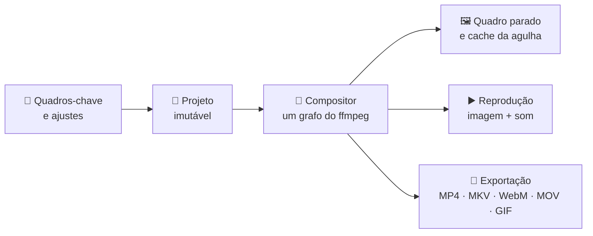

<div align="center">


# Video Manager

**Baixe, converta e edite vídeo — tudo em um só aplicativo.**<br>
Desktop para Windows e Linux, em português, movido por [yt-dlp](https://github.com/yt-dlp/yt-dlp) e [ffmpeg](https://ffmpeg.org).

[](https://github.com/GianBala/Video_Manager/actions/workflows/tests.yml)


<sub>Esta animação foi renderizada pelo exportador de GIF do próprio Video Manager.</sub>

[O que faz](#o-que-faz) · [Editor](#o-editor) · [Começar](#começar) · [Como funciona](#como-funciona) · [Documentação](#documentação)

</div>

---

## O que faz

<table>
<tr>
<td width="33%" valign="top">

### ⬇️ Download

Cole um endereço, escolha a qualidade e pronto.

- Resolução, framerate, codec e container **a partir do que a mídia realmente oferece**
- **Somente áudio**: MP3, M4A/AAC, Opus, Vorbis, FLAC, WAV — ou *Original*, sem recodificar
- **Playlists e canais** em lote, item a item
- Legendas (inclusive automáticas), capa e metadados
- Cookies do navegador para mídias privadas
- **Perfis rápidos** de um clique
- Centenas de plataformas, via yt-dlp

</td>
<td width="33%" valign="top">

### 🔄 Convert

Converta o que já está no disco.

- Arraste os arquivos e escolha o destino
- Áudio (MP3, M4A, Opus, FLAC…) ou vídeo (MP4, MKV, WebM…)
- **Copiar** faz remux instantâneo e sem perda, quando o container aceita o codec
- H.264, HEVC, VP9 ou AV1, com redimensionamento de 2160p a 360p
- O plano aparece **antes**: “o que vai acontecer”
- Placa de vídeo opcional (NVENC, Quick Sync, AMF, VAAPI), testada de verdade

</td>
<td width="33%" valign="top">

### ✂️ Editar

Edição multipista, sem sair do aplicativo.

- Vídeo, fotos, texto, filtros e áudio em **trilhas em qualquer ordem**
- **Transições**, **animação por quadros-chave** e **chroma key**
- Prévia com o **som da mixagem**, loop sem corte e quadro a quadro
- Exporta **MP4, MKV, WebM, MOV ou GIF**
- **Corte sem recodificar** quando a edição é só um recorte

</td>
</tr>
</table>

As três abas compartilham **uma fila de tarefas**: baixe, converta e exporte ao mesmo tempo, cancele, tente de novo e consulte o histórico de erros. No editor a fila sai de cena, para o vídeo ocupar a janela.

<p align="center">
  
</p>

<table>
<tr>
<td width="50%"></td>
<td width="50%"></td>
</tr>
<tr>
<td align="center"><sub><b>Download</b> — qualidade vinda da própria mídia e perfis de um clique</sub></td>
<td align="center"><sub><b>Convert</b> — o plano da conversão aparece antes de enfileirar</sub></td>
</tr>
</table>

<sub>Capturas feitas com mídia sintética por [`scripts/capture_screenshots.py`](scripts/capture_screenshots.py).</sub>

## Por que é diferente

- 🎯 **Opções reais, não uma lista fixa.** O que aparece nos combos vem do que aquela mídia oferece — e um extrator que não informa `fps` não faz as opções sumirem.
- 🔒 **Nada de recodificação escondida.** Se o container não aceita o codec, o app troca de stream ou de container e **avisa antes** de baixar.
- 🎞️ **O que você vê é o que sai.** A prévia e o arquivo exportado nascem do mesmo grafo do ffmpeg: trilhas sobrepostas, volume, transições e animações aparecem na tela como ficarão no resultado.
- ✂️ **Corte sem recodificar, com honestidade.** Só se corta sem recodificar num *keyframe*; o app mostra o ponto real do corte antes de enfileirar.
- 🧵 **A interface não trava.** O trabalho pesado roda em segundo plano, e cancelar alcança os subprocessos.

## O editor

Multipista, com os gestos que o CapCut e o Filmora tornaram padrão.

<details>
<summary><b>Tudo o que o editor faz</b></summary>

<br>

- **Trilhas em qualquer ordem** — vídeo (com fotos), adicionais (texto e filtros) e áudio. Entre vídeo e adicionais, a trilha de cima sobrepõe as de baixo.
- **Acervo e arrasto** — importe para o acervo e arraste a mídia até a trilha e o instante desejados, com bloco fantasma e ímã.
- **Blocos** — arraste no tempo e entre trilhas, ajuste o corte pelas alças, divida no cursor, copie e cole, separe o áudio de um vídeo.
- **Som** — volume por bloco em decibéis, mudo por trilha ou por bloco e **velocidade** de 0,1× a 10×.
- **Transições** entre dois cortes — Fade, Dissolve, Wipe, Slide.
- **Texto, filtros e chroma key.**
- **Animação por quadros-chave** — posição, escala, rotação e opacidade, com curvas de aceleração e efeitos rápidos de entrada; editável direto na prévia ou na aba **Propriedades**.
- **Prévia** — retrátil, em tela cheia (`F`), com o som da mixagem, loop sem corte e navegação quadro a quadro. Arrastar a agulha responde na hora.
- **Tela** — proporção 16:9, 4:3, 9:16, 1:1 ou 21:9, e *Slideshow* para montagens só de fotos.
- **Projetos `.vmp`** — Salvar e Salvar como, desfazer e refazer (cada gesto é um único passo).
- **Exportar** — MP4, MKV, WebM, MOV ou GIF animado; corte rápido sem recodificar; interpolação de movimento; codificação pela placa de vídeo.

Veja o [guia do editor](docs/guia-edicao.md) para atalhos e detalhes.

</details>

## Começar

```bash
git clone https://github.com/GianBala/Video_Manager.git && cd Video_Manager
python3 -m venv .venv
.venv/bin/pip install -e ".[dev]"
PYTHONPATH=src .venv/bin/python -m videomanager
```

No Windows, use `.venv\Scripts\python`. Na primeira execução o app procura o `ffmpeg` — empacotado, baixado antes ou no `PATH` — e, se não achar, oferece baixar a build oficial (~130 MB) numa pasta só dele, sem alterar nada no sistema. No Linux, o Qt precisa de `libxcb-cursor0` (`sudo apt install libxcb-cursor0`).

**Gerar um pacote** — cada sistema gera o seu; os scripts rodam os testes, embutem o ffmpeg e **abrem o resultado para confirmar que ele sobe**:

```bash
./packaging/build_appimage.sh   # Linux   → AppImage
.\packaging\build_windows.ps1   # Windows → VideoManager.exe, arquivo único
```

Mais em [empacotamento](docs/empacotamento.md) e [instalação](docs/instalacao.md).

## Como funciona



O código segue **Clean Architecture**: domínio e aplicação funcionam sem Qt, yt-dlp ou ffmpeg — e há testes que provam isso —, e as integrações ficam em adaptadores.

```text
src/videomanager/
├── domain/          modelos imutáveis e regras puras
├── application/     casos de uso, sessão, tarefas e portas
├── infrastructure/  ffmpeg, yt-dlp, arquivos e adaptadores Qt
├── presentation/    janela, painéis e widgets
├── bootstrap.py     montagem explícita dos serviços
└── app.py           inicialização Qt e recursos
```

**Qualidade** — mais de 1.300 testes: domínio e aplicação sem Qt; interface Qt com eventos reais; e **mídia de verdade**, medindo duração, quadros, volume e streams do arquivo gerado em vez de comparar comandos. Respostas reais de extratores (YouTube, archive.org, HLS, SoundCloud, Instagram) e o parser do próprio yt-dlp validam cada expressão de formato. A CI roda em Ubuntu e Windows, com Python 3.10 e 3.12 e ffmpeg 6.1, 7.1 e 9.0, e gera e abre os pacotes de Linux e Windows.

## Documentação

| Para… | Leia |
| --- | --- |
| **Usar** | [Manual](docs/README.md) · [Instalação](docs/instalacao.md) · [Download](docs/guia-download.md) · [Convert](docs/guia-conversao.md) · [Editor](docs/guia-edicao.md) · [Configurações](docs/configuracoes.md) |
| **Entender o código** | [Guia de arquitetura](docs/clean-architecture/README.md) · [Decisões de projeto](docs/decisoes-de-projeto.md) · [Catálogo de módulos](docs/clean-architecture/modulos.md) |
| **Contribuir** | [Guia de desenvolvimento](docs/desenvolvimento.md) · [Testes](docs/clean-architecture/testes.md) · [Empacotamento](docs/empacotamento.md) |

## Aviso

Este aplicativo é uma interface para o yt-dlp. Respeitar os termos de uso e os direitos autorais de cada plataforma é responsabilidade de quem usa.
