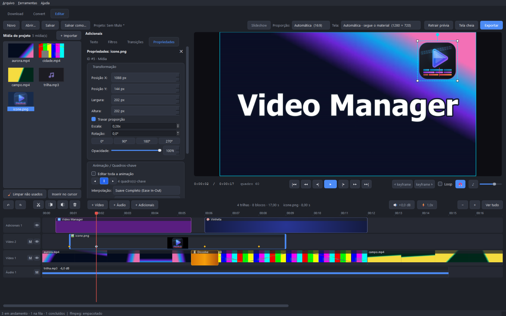
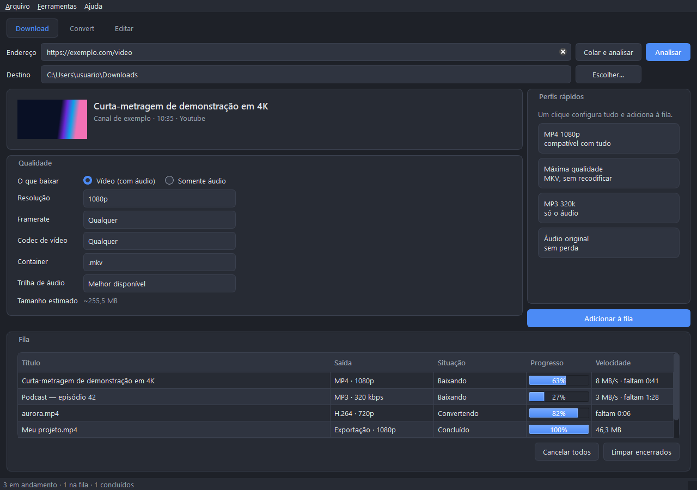
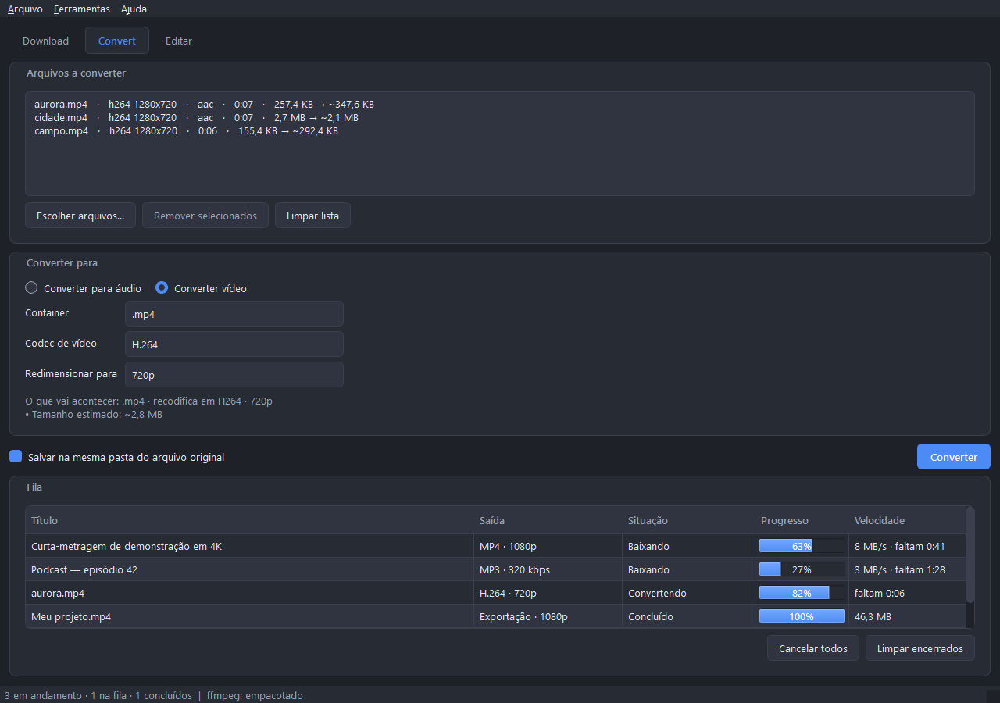
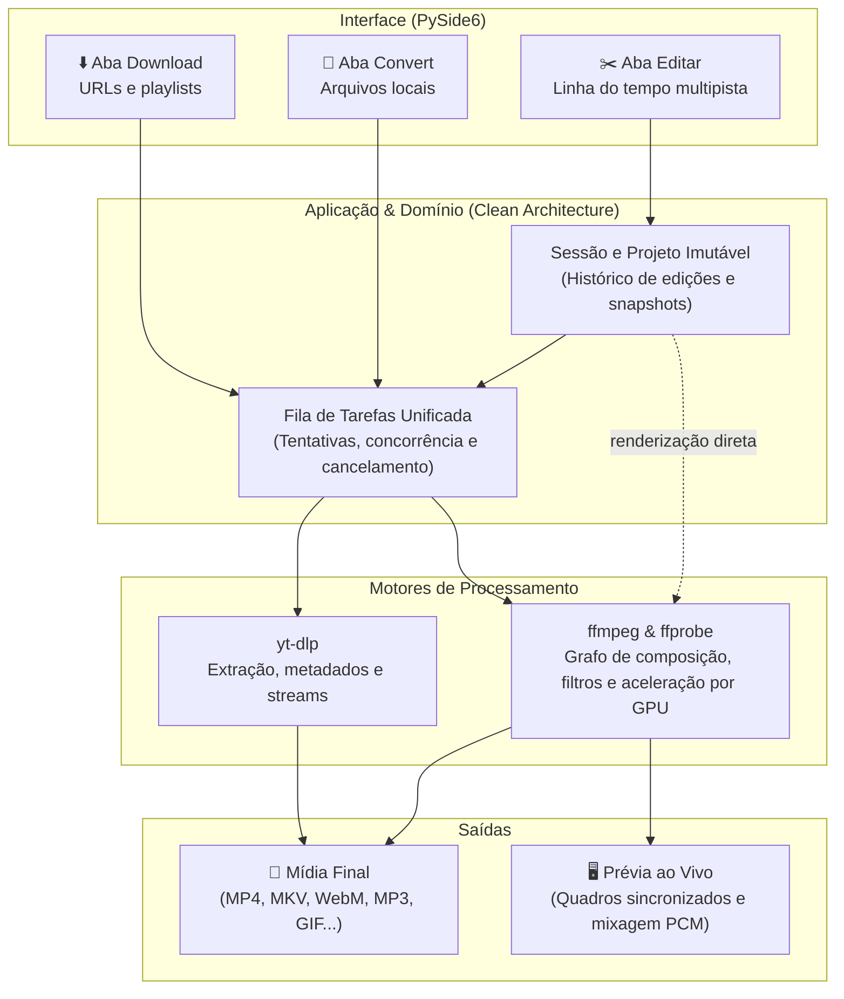

<div align="center">


# Video Manager

**Baixe, converta e edite vídeo — tudo em um só aplicativo.**<br>
Desktop para Windows e Linux, em português e inglês, movido por [yt-dlp](https://github.com/yt-dlp/yt-dlp) e [ffmpeg](https://ffmpeg.org).

[](https://github.com/GianBala/Video_Manager/actions/workflows/tests.yml)


<sub>Esta animação foi renderizada pelo exportador de GIF do próprio Video Manager.</sub>

[O que faz](#o-que-faz) · [Editor](#o-editor) · [Começar](#começar) · [Como funciona](#como-funciona) · [Documentação](#documentação)

</div>

---

## O que faz

<table>
<tr>
<td width="33%" valign="top">

### ⬇️ Download

Cole o endereço e baixe com opções reais da fonte.

- **Opções reais**: resolução, framerate e codecs (H.264, VP9, AV1) detectados direto da mídia, sem listas fixas
- **Somente áudio**: modo *Original* (sem recodificar) ou conversão para MP3, M4A, Opus, FLAC, Vorbis e WAV
- **Playlists e canais** em lote, com seleção item a item
- **Legendas** embutidas ou externas (inclusive automáticas), capas e metadados
- **Cookies do navegador** para mídias privadas ou restritas
- **Perfis rápidos** de um clique
- Centenas de plataformas via yt-dlp

</td>
<td width="33%" valign="top">

### 🔄 Convert

Converta e reprocesse mídias locais com rapidez.

- **Conversão em lote**: arraste arquivos e converta vídeo (MP4, MKV, WebM, MOV) e áudio (MP3, M4A, Opus, FLAC…)
- **Copiar (remux)**: troca de container instantânea e sem perda quando os codecs já são compatíveis
- **Plano transparente**: mostra exatamente o que vai acontecer com cada trilha antes de enfileirar
- **Resoluções e codecs**: H.264, HEVC, VP9 ou AV1, de 2160p até 360p
- **Placa de vídeo** (NVENC, Quick Sync, AMF, VAAPI) testada de verdade, com recuo automático para CPU

</td>
<td width="33%" valign="top">

### ✂️ Editar

Edição multipista completa, sem sair do aplicativo.

- **Trilhas livres**: vídeos, fotos, áudios, textos e filtros em qualquer ordem
- **Cortes precisos**: montagem magnética com ímã, alças de corte, divisão no cursor e separação de áudio
- **Efeitos e transições**: Dissolve, Wipe, Slide, Fade, filtros de cor, chroma key e quadros-chave
- **Prévia fiel**: reprodução com o som da mixagem em tempo real, loop sem corte e tela cheia (`F`)
- **Exportação versátil**: MP4, MKV, WebM, MOV ou GIF animado, e corte sem recodificar em keyframes

</td>
</tr>
</table>

As três abas compartilham **uma fila de tarefas unificada**: baixe, converta e exporte ao mesmo tempo em segundo plano, com cancelamento, nova tentativa e histórico de erros. No editor a fila sai de cena, para o vídeo ocupar a janela.

<p align="center">
  
</p>

<table>
<tr>
<td width="50%"></td>
<td width="50%"></td>
</tr>
<tr>
<td align="center"><sub><b>Download</b> — qualidade vinda da própria mídia e perfis de um clique</sub></td>
<td align="center"><sub><b>Convert</b> — o plano da conversão aparece antes de enfileirar</sub></td>
</tr>
</table>

<sub>Capturas feitas com mídia sintética por [`scripts/capture_screenshots.py`](scripts/capture_screenshots.py).</sub>

## O editor

Multipista, com os gestos que o CapCut e o Filmora tornaram padrão.

<details>
<summary><b>Tudo o que o editor faz</b></summary>

<br>

- **Trilhas em qualquer ordem** — vídeo (com fotos), adicionais (texto e filtros) e áudio. Entre vídeo e adicionais, a trilha de cima sobrepõe as de baixo.
- **Acervo e arrasto** — importe para o acervo e arraste a mídia até a trilha e o instante desejados, com bloco fantasma e ímã.
- **Blocos** — arraste no tempo e entre trilhas, ajuste o corte pelas alças, divida no cursor, copie e cole, separe o áudio de um vídeo.
- **Som** — volume por bloco em decibéis, mudo por trilha ou por bloco e **velocidade** de 0,1× a 10×.
- **Transições** entre dois cortes — Fade, Dissolve, Wipe, Slide.
- **Texto, filtros e chroma key.**
- **Animação por quadros-chave** — posição, escala, rotação e opacidade, com curvas de aceleração e efeitos rápidos de entrada; editável direto na prévia ou na aba **Propriedades**.
- **Prévia** — retrátil, em tela cheia (`F`), com o som da mixagem, loop sem corte e navegação quadro a quadro. Arrastar a agulha responde na hora.
- **Tela** — proporção 16:9, 4:3, 9:16, 1:1 ou 21:9, e *Slideshow* para montagens só de fotos.
- **Projetos `.vmp`** — Salvar e Salvar como, desfazer e refazer (cada gesto é um único passo).
- **Exportar** — MP4, MKV, WebM, MOV ou GIF animado; corte rápido sem recodificar; interpolação de movimento; codificação pela placa de vídeo.

Veja o [guia do editor](docs/guia-edicao.md) para atalhos e detalhes.

</details>

## Começar

```bash
git clone https://github.com/GianBala/Video_Manager.git && cd Video_Manager
python3 -m venv .venv
.venv/bin/pip install -e ".[dev]"
PYTHONPATH=src .venv/bin/python -m videomanager
```

No Windows, use `.venv\Scripts\python`. Na primeira execução o app procura o `ffmpeg` — empacotado, baixado antes ou no `PATH` — e, se não achar, oferece baixar a build oficial (~130 MB) numa pasta só dele, sem alterar nada no sistema. No Linux, o Qt precisa de `libxcb-cursor0` (`sudo apt install libxcb-cursor0`).

**Gerar um pacote** — cada sistema gera o seu; os scripts rodam os testes, embutem o ffmpeg e **abrem o resultado para confirmar que ele sobe**:

```bash
./packaging/build_appimage.sh   # Linux   → AppImage
.\packaging\build_windows.ps1   # Windows → VideoManager.exe, arquivo único
```

Mais em [empacotamento](docs/empacotamento.md) e [instalação](docs/instalacao.md).

## Como funciona



O código segue **Clean Architecture**: as regras de negócio do domínio e a orquestração da aplicação são desacopladas da interface e de bibliotecas externas (sem dependências de Qt, yt-dlp ou subprocessos). As integrações com ferramentas e sistema operacional ficam isoladas em adaptadores de infraestrutura.

```text
src/videomanager/
├── domain/          modelos imutáveis e regras de negócio puras
├── application/     casos de uso, histórico de sessão e contratos (portas)
├── infrastructure/  adaptadores ffmpeg, yt-dlp, arquivos e Qt
├── presentation/    janela, painéis, controles e linha do tempo
├── bootstrap.py     montagem explícita e injeção de dependências
└── app.py           inicialização da aplicação Qt e recursos
```

**Confiabilidade com testes reais** — mais de 1.300 testes automatizados:
- **Domínio e aplicação puros**: executados sem instanciar Qt, sem rede e sem tocar no disco.
- **Interface e interação**: testes em Qt offscreen com eventos reais de clique, arrasto e atalhos.
- **Mídia de verdade**: conferência de conversões e edições com `ffprobe`, medindo duração exata, contagem de quadros, trilhas e níveis de áudio do arquivo resultante.
- **Fixtures reais de extratores**: respostas capturadas de serviços reais (YouTube, archive.org, SoundCloud, HLS) validadas contra o parser do próprio yt-dlp. A CI roda em Ubuntu e Windows, com Python 3.10 e 3.12 e ffmpeg 6.1, 7.1 e 9.0, garantindo também que os pacotes finais abram corretamente.

## Documentação

| Para… | Leia |
| --- | --- |
| **Usar** | [Manual](docs/README.md) · [Instalação](docs/instalacao.md) · [Download](docs/guia-download.md) · [Convert](docs/guia-conversao.md) · [Editor](docs/guia-edicao.md) · [Configurações](docs/configuracoes.md) |
| **Entender o código** | [Guia de arquitetura](docs/clean-architecture/README.md) · [Decisões de projeto](docs/decisoes-de-projeto.md) · [Catálogo de módulos](docs/clean-architecture/modulos.md) |
| **Contribuir** | [Guia de desenvolvimento](docs/desenvolvimento.md) · [Testes](docs/clean-architecture/testes.md) · [Empacotamento](docs/empacotamento.md) |

## Aviso

Este aplicativo é uma interface para o yt-dlp. Respeitar os termos de uso e os direitos autorais de cada plataforma é responsabilidade de quem usa.
