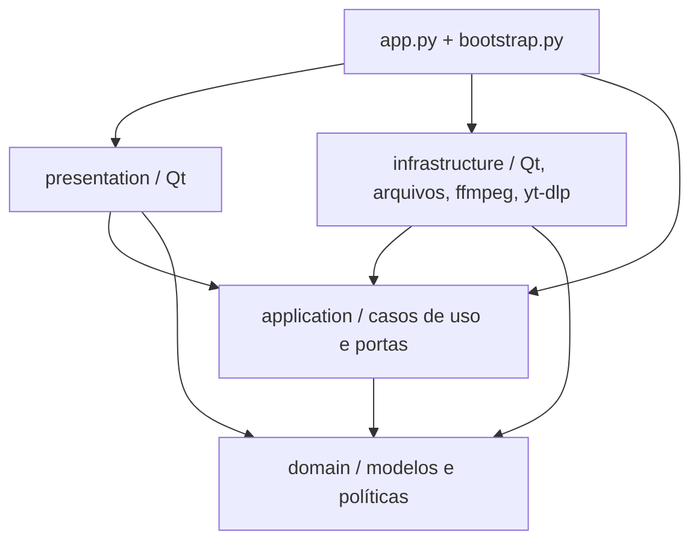

# Guia de arquitetura para desenvolvedores

Video Manager é um aplicativo desktop em pt-BR para baixar, converter e editar
vídeo/áudio. Python coordena o trabalho, PySide6 apresenta a interface, yt-dlp
acessa plataformas e ffmpeg/ffprobe processam e inspecionam mídia. O projeto
`.vmp` guarda uma montagem e referências aos arquivos originais.

Este guia descreve a implementação atual. O [plano](../plano-clean-architecture.md)
registra a proposta original; o [registro da migração](migracao.md) reúne
entregas e limites da validação.

## O que Clean Architecture significa aqui

Uma regra de edição deve continuar funcionando sem janela, arquivo JSON ou
executável ffmpeg. Separamos as decisões do aplicativo dos mecanismos usados
para executá-las.

- **Domínio:** descreve o problema. Um clipe ocupa um intervalo, tem origem,
  volume, velocidade e transformações. Um projeto reúne esses clipes.
- **Aplicação:** coordena operações. Salvar captura o projeto correto, pede a
  gravação e registra qual versão foi salva.
- **Porta:** contrato que a aplicação exige do mundo externo, expresso como
  um `Protocol` Python. Exemplo: `ProjectRepository.save(project, path)`.
- **Infraestrutura:** implementa portas e integra ferramentas.
  `JsonProjectRepository` serializa o projeto e grava o JSON.
- **Apresentação:** traduz gestos, campos e sinais em chamadas dos serviços ou
  operações dos modelos; apresenta resultados em widgets, avisos e rótulos.
- **Montagem:** `bootstrap.py` e `app.py` escolhem os adaptadores e os
  entregam aos consumidores. Não há contêiner de injeção.

A seta significa **importa/conhece o código**, não a ordem dos eventos:



Durante uma gravação, a aplicação chama um adaptador. Mesmo assim, o import
aponta para dentro: o serviço conhece a porta, e a classe recebida no
construtor satisfaz esse contrato. Essa diferença entre fluxo de execução e
dependência de código é a ideia central.

## Estrutura

```text
src/videomanager/
├── domain/                   modelos imutáveis e regras determinísticas
├── application/
│   ├── editor/               sessão, abertura, importação e salvamento
│   ├── jobs/                 pedidos e estados das tarefas
│   ├── media/                preparação de download, processamento e prévia
│   └── ports/                contratos dos casos de uso
├── infrastructure/
│   ├── ffmpeg/               probe, comandos, composição e quadros
│   ├── yt_dlp/               extração, normalização, seletores e download
│   ├── storage/              projetos, preferências e saídas
│   ├── system/               binários, subprocessos e recursos da máquina
│   └── qt/                   áudio, texto e workers/pools
├── presentation/qt/          janela, controllers, painéis e widgets
├── bootstrap.py              criação dos serviços e adaptadores
├── app.py                    QApplication, recursos e montagem da janela
├── preflight.py              diagnóstico das bibliotecas gráficas
└── resources/                ícones e fontes
```

`domain` e `application` usam apenas a biblioteca padrão. Não importam Qt,
yt-dlp, platformdirs, subprocessos ou os antigos pacotes `core/ui/workers`.
A apresentação não importa infraestrutura: recebe `DesktopRuntimePort`,
contrato definido em `presentation/qt/ports.py`, para serviços específicos
do desktop. `DesktopRuntime` implementa fábricas de workers e consultas ao
ambiente; não possui sessão ou estado das tarefas.

Nem toda função precisa de uma porta. Calcular duração ou aplicar um corte
a um modelo puro pode ser uma chamada direta. As portas existem nos pontos
de efeitos externos que precisam ser substituíveis. Formatações usadas em
descrições de tarefas ficam em `application/formatting.py` e
`format_labels.py`; a tradução visual dos estados fica na apresentação.

## Um exemplo que funciona sem Qt

```python
from pathlib import Path
from videomanager.application.editor.service import EditorService

class MemoryRepository:
    def __init__(self):
        self.written = {}

    def save(self, project, path):
        self.written[path] = project

    def load(self, path):
        return self.written[path], []

repository = MemoryRepository()
editor = EditorService(repository)
snapshot = editor.session.snapshot()
path = Path("minha-edicao.vmp")
editor.write_snapshot(snapshot, path)
editor.accept_saved(snapshot, path)
assert not editor.session.has_changes
```

Esse programa não cria Qt nem grava um arquivo. No desktop, o bootstrap
fornece `JsonProjectRepository`; a escrita roda numa pool e o resultado é
aceito na thread principal. A regra sobre qual versão foi salva é a mesma.

## Percurso de leitura

| Capítulo | O que explica |
| --- | --- |
| [Editor e projetos](editor.md) | Modelo temporal, identidade, histórico, abrir/importar/salvar e JSON. |
| [Tarefas e concorrência](tarefas.md) | Estados, tentativas, sinais, pools, cancelamento e publicação. |
| [Conversão e exportação](processamento.md) | Preparação, cortes, composição, hardware e paralelismo. |
| [Downloads](downloads.md) | Metadados, escolhas, compatibilidade, yt-dlp e playlists. |
| [Prévia, áudio e texto](previa.md) | Quadros, busca, sincronismo, buffers, caches e rasterização. |
| [Catálogo de módulos](modulos.md) | Papel de cada módulo e pontos de entrada para alterações. |
| [Como evoluir o projeto](evolucao.md) | Mudanças atravessando camadas, diagnóstico e distribuição. |
| [Testes](testes.md) | Ambientes, fronteiras, testes reais e medições reproduzíveis. |
| [Checkup final](validacao-final.md) | Regressões corrigidas e validação de mídia, áudio, GPU e distribuição na conclusão da migração. |
| [Registro da migração](migracao.md) | Etapas implementadas e evidências disponíveis na conclusão da migração. |

Os dois últimos são **registros datados** (7 e 8 de setembro de 2026): guardam
o que foi medido naquele momento e não são atualizados a cada mudança. O estado
atual do código é o dos capítulos acima.

## Contratos que devem continuar verdadeiros

O projeto é imutável; sessão e fila têm donos explícitos. Workers recebem
snapshots e pedidos, e não alteram widgets ou o projeto atual. Eventos antigos
não podem sobrescrever uma edição, análise ou tentativa nova. Comandos e
dicionários das ferramentas ficam nos adaptadores. Prévia e exportação usam
o mesmo compositor. Uma saída cancelada antes da publicação não deve aparecer
como arquivo concluído. Um gesto de edição é uma única transação de histórico,
e um resultado de prévia só chega à tela no contexto que o pediu (geração,
revisão, instante, tamanho e taxa). O que está na tela durante um gesto é a
composição real, e o cache de quadros da agulha nunca substitui o quadro exato
quando a mão para.

Esses contratos têm testes de aplicação, contratos e arquitetura, além da
integração real. Eles importam mais do que reproduzir pastas mecanicamente.
