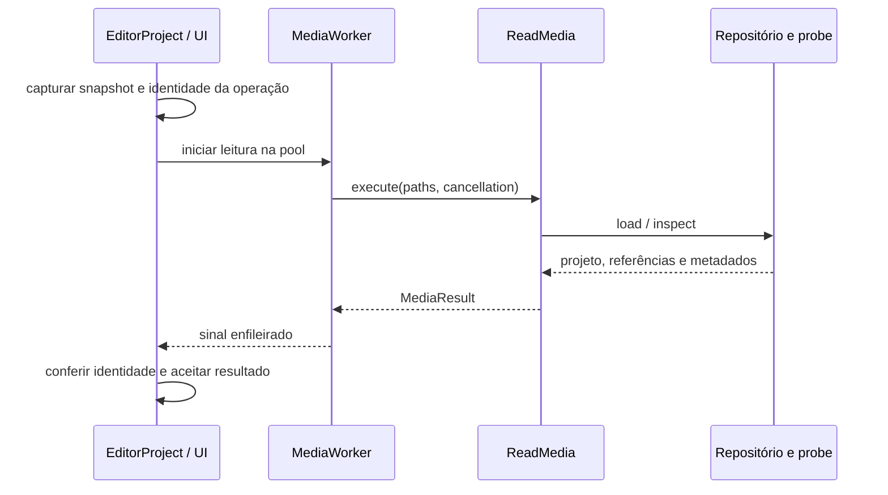

# Editor, sessão e arquivos de projeto

## Entender o modelo antes dos widgets

`Project`, `Track`, `Clip` e `MediaRef` ficam em `domain/project.py`.
São dataclasses imutáveis: uma operação devolve outro modelo, compartilhando
referências às partes que não mudaram.

| Conceito | Significado |
| --- | --- |
| `MediaRef` | Caminho e características necessárias para editar uma mídia; não contém bytes do vídeo. |
| `Clip` | Uso de uma mídia na montagem: tempo, transformações, volume, velocidade e adicionais. |
| `Track` | Trilha de vídeo, áudio ou adicionais, com identidade, visibilidade e mudo. |
| `Project` | Trilhas, dimensões, fps e operações de edição/exportação. |
| `LocalMedia` | Resultado da inspeção local, com streams e codecs; `media_ref` o converte em referência de edição. |

Um clipe tem duas referências temporais. `start` é a posição na montagem;
`in_point` é a posição no arquivo. `duration` é a duração na montagem.
Por exemplo, `start=12`, `in_point=30`, `duration=4`, `speed=2` ocupa
12–16 segundos da edição e usa 30–38 segundos do arquivo.

As trilhas são armazenadas na ordem visual, de cima para baixo. O compositor
percorre vídeo de baixo para cima para construir fundo e sobreposições.
Texto, filtro e transição têm referência sintética: ela não deve ser sondada
como arquivo. Uma imagem importada continua tendo um arquivo real.

### Transições pertencem ao corte

Uma transição não é uma camada livre nem um terceiro vídeo. O marcador vive na
trilha de vídeo e referencia `transition_left_id` e `transition_right_id`, que
devem ser clipes adjacentes e encostados. `Project.transition_context` é a fonte
única para resolver o corte, centralizar a duração e impor o limite dado pelas
duas pontas. Se uma ponta for excluída ou os clipes deixarem de formar aquele
corte, o marcador ligado é removido; ele nunca se associa por proximidade a
outra edição.

Na inserção, selecionar um clipe de vídeo restringe os candidatos aos cortes de
que ele participa, inclusive quando várias trilhas têm cortes no mesmo instante.
Um clipe selecionado sem vizinho encostado produz aviso, sem cair em outra
trilha. Sem seleção, permanece o comportamento global: vence o corte mais
próximo do cursor.

O retângulo desenhado na timeline pode ter uma largura mínima maior que sua
duração em escala. Essa diferença é intencional: aumenta o alvo de seleção sem
alterar o intervalo renderizado. Ao arrastar uma borda, as duas extremidades se
movem simetricamente em torno do corte; o corpo não pode ser deslocado.
O domínio impõe 0,2 s como duração mínima da transição, inclusive ao carregar
projetos antigos, para que a timeline não contorne o limite dos campos da UI.

`transition_affects_additionals` controla o limite de composição do efeito.
Desligado por padrão, preserva a pilha de trilhas: a passagem ocorre no vídeo e
filtros, imagens e textos continuam por cima. Ligado, cada lado do `xfade`
recebe os itens visíveis das trilhas de Adicionais que pertencem àquele lado.
Um item que termina no corte sai com o clipe esquerdo; um que começa no corte
entra com o direito; um que atravessa o corte existe nos dois lados e permanece
contínuo. O campo é persistido no `.vmp` e ausente significa `false` para manter
compatibilidade com projetos anteriores.

`clip_id` e `track_id` identificam objetos ao longo das transformações;
`dataclasses.replace` preserva os IDs. Duplicações criam a identidade da
nova entidade. Seleção e caches não devem depender apenas da posição numa
lista, pois cortes e reordenações a alteram.

## Quem possui o estado

`application/editor/session.py` mantém projeto atual, caminho, ponto salvo,
histórico e futuro. O histórico público é uma tupla, sem acesso à lista interna.

| Operação | Efeito |
| --- | --- |
| `remember()` | Captura o estado anterior, limita o histórico a 60 e limpa refazer. |
| `replace_current(project)` | Instala o projeto e avança a revisão quando o conteúdo muda. |
| `undo()` / `redo()` | Movem projetos entre histórico, atual e futuro. |
| `snapshot()` | Captura projeto, caminho, geração e revisão. |
| `reset(project, path)` | Inicia outra sessão, limpa histórico e muda a geração. |
| `mark_saved(snapshot, path)` | Marca a versão gravada se ela pertence à mesma sessão. |

`has_changes` compara conteúdo com o ponto salvo. Quantidade de ações não
indica se há alterações: desfazer pode retornar exatamente à versão salva.

`EditPanel` reúne widgets e controller dos gestos de edição. Aplica operações
puras de `Project`, instala o resultado pela sessão e atualiza seleção,
timeline, propriedades e prévia. Não possui outra cópia mutável do projeto.
`Timeline` desenha e emite intenções; não grava arquivos nem executa ffmpeg.

## Abrir e importar

`ReadMedia` elimina caminhos duplicados, reaproveita referências conhecidas,
consulta o probe e acumula rejeitados. Na abertura, o repositório devolve o
projeto e caminhos ausentes. A montagem é preservada mesmo quando uma mídia
precisa ser localizada novamente; a inspeção complementar não reconstrói a
edição do zero.

O cancelamento é consultado antes da operação, entre arquivos e antes do
retorno. O adaptador de probe conecta essa consulta ao controle do processo.
`MediaResult` transporta projeto, referências, cache de inspeção, ausentes e
rejeitados. O worker produz esses dados, sem modificar a sessão compartilhada.

`EditorService.accept_opened` confere **geração e revisão**. Se outra edição
ou sessão surgiu durante a leitura, a resposta não é instalada.
`EditorProject` também identifica a operação visual ativa e acessa o painel
por APIs públicas como `accept_import`, `install_project`,
`current_project` e `media_references`.

## Salvar sem perder edições

1. O controller escolhe o caminho e captura `SessionSnapshot`.
2. `FunctionWorker` chama `EditorService.write_snapshot` na pool serial.
3. O repositório escreve aquele projeto. A sessão não muda nessa thread.
4. O sinal chega à thread principal; `accept_saved` marca o snapshot gravado.
5. O rótulo do projeto é recalculado.

Se o usuário editou A para B após a captura, salvar A deixa B marcado como
alterado. Se a sessão inteira mudou, a confirmação de A é ignorada.
Se a gravação falhar, caminho e ponto salvo não são atualizados.

O diálogo de progresso mantém o laço de eventos Qt ativo durante a escrita.
Ele termina pelo resultado da operação; Escape não abandona uma gravação
que ainda pode emitir callbacks.

## Formato .vmp

`infrastructure/storage/project_json.py` mantém o esquema JSON versão 1.
`projects.py` o expõe pela porta `ProjectRepository`. A reorganização
preserva extensão, IDs e significado dos campos.

O projeto referencia mídias externas. Caminhos relativos são resolvidos em
relação ao arquivo de projeto; mover só o `.vmp` não move os vídeos.
A serialização inclui trilhas, clipes, propriedades e tela. A gravação usa
temporário no mesmo diretório e substituição atômica, preservando o arquivo
anterior em caso de falha antes da entrega.

`tests/test_project_io.py` cobre persistência real.
`tests/application/test_editor.py` cobre histórico, falhas e respostas
atrasadas com repositório em memória, sem Qt ou disco.

## Onde alterar

Transformações de clipe começam no domínio. Coordenação de sessão e
persistência começa na aplicação. Atalhos, seleção, foco e diálogo pertencem
à apresentação. O JSON pertence ao adaptador e exige compatibilidade.
Um campo persistido novo também pode exigir mudança em compositor, prévia e
política de corte rápido: copiar streams pode deixar de representar a edição.

## Cuidados na substituição e no salvamento

A igualdade dos modelos ignora IDs. `EditorSession.replace_current` instala
objetos novos mesmo quando o conteúdo é igual, incrementando a revisão e
preservando as identidades do histórico. O cálculo de mudanças pendentes
continua comparando conteúdo.

A gravação modal só termina com resultado do worker. Fechar o diálogo e Escape
não abandonam uma gravação em andamento. O controller retorna a aceitação do
snapshot; uma sessão substituída não é considerada salva por uma resposta antiga.
