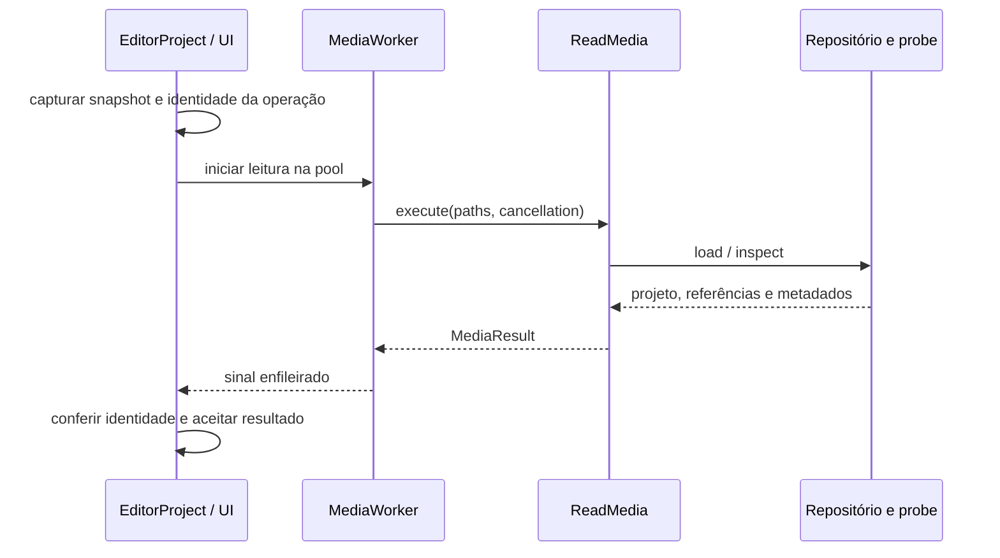

# Editor, sessão e arquivos de projeto

## Entender o modelo antes dos widgets

`Project`, `Track`, `Clip` e `MediaRef` ficam em `domain/project.py`.
São dataclasses imutáveis: uma operação devolve outro modelo, compartilhando
referências às partes que não mudaram.

| Conceito | Significado |
| --- | --- |
| `MediaRef` | Caminho e características necessárias para editar uma mídia; não contém bytes do vídeo. |
| `Clip` | Uso de uma mídia na montagem: tempo, transformações, volume, velocidade e adicionais. |
| `Track` | Trilha de vídeo, áudio ou adicionais, com identidade, visibilidade e mudo. |
| `Project` | Trilhas, dimensões, fps e operações de edição/exportação. |
| `LocalMedia` | Resultado da inspeção local, com streams e codecs; `media_ref` o converte em referência de edição. |

Um clipe tem duas referências temporais. `start` é a posição na montagem;
`in_point` é a posição no arquivo. `duration` é a duração na montagem.
Por exemplo, `start=12`, `in_point=30`, `duration=4`, `speed=2` ocupa
12–16 segundos da edição e usa 30–38 segundos do arquivo.

As trilhas são armazenadas na ordem visual, de cima para baixo. O compositor
percorre vídeo de baixo para cima para construir fundo e sobreposições.
A ordem é livre: vídeo, adicionais e áudio podem estar intercalados, e a
prioridade visual é só a posição. `Project.with_track` põe adicionais no topo,
vídeo logo acima da trilha de vídeo mais alta (ou antes do primeiro áudio) e
áudio no fim; o cabeçalho arrastado aceita qualquer posição. Uma transição que
afeta adicionais só leva as trilhas de adicionais **acima** da trilha dela.
Texto, filtro e transição têm referência sintética: ela não deve ser sondada
como arquivo. Uma imagem importada continua tendo um arquivo real.

Imagem vive na trilha de vídeo (`accepts`); Adicionais guardam texto e filtro
(`Clip.is_overlay`). `Clip.is_additional` continua valendo para o **tempo** do
bloco — sem `in_point`, fim livre, sem som, fora do corte rápido — e inclui a
imagem. O tamanho base de toda imagem vem de `geometry.image_base_size`, que a
ajusta à tela como vídeo; compositor, prévia e propriedades usam só essa função.
`auto_canvas` ignora fotos: adotar o formato delas é a escolha explícita de
`slideshow_canvas`.

Foto e sequência temporal se distinguem pela **estrutura do contêiner**
(`LocalMedia.is_image`: codec de imagem em demuxer estático, sem áudio), e não
pelo codec: um MJPEG em AVI é vídeo. A sondagem também guarda a duração de cada
trilha, porque o container pode ser mais longo que a imagem (AAC com sobra, 23,976
fps); um bloco novo de vídeo dura o que tem imagem. A conversão entre tempo da
edição e tempo da origem (`source_time`, `timeline_time`, `available_duration`),
com a velocidade, fica em `domain/timing.py` e é a única fonte dessa aritmética
para `Clip`, `Project.resized` e `Project.split`.

### Trilhas, nomes e soltura de mídia

`Project.with_track` cria uma trilha vazia num lugar previsível (adicionais no
topo, vídeo acima do vídeo mais alto, áudio no fim) ou no `index` que o gesto
pediu. O nome padrão usa o **primeiro número livre** entre os nomes no padrão
"Espécie N": apagar "Vídeo 2" de três trilhas e criar outra devolve "Vídeo 2".
Nomes escolhidos pelo usuário não entram na conta.

`Project.with_dropped_clip(clip, track_index, new_track_index)` recebe o bloco
já montado e o lugar da soltura. Se a trilha sob o ponteiro aceita o bloco e o
vão comporta a duração, ele fica no instante pedido (encostado na borda do vão
quando não cabe inteiro a partir dali). Senão nasce uma trilha da espécie certa
em `new_track_index` — adicionais para texto/filtro, vídeo para imagem e
transição, áudio para o resto. Nada que já estava na edição é empurrado. A
apresentação decide o que soltar e onde (cartão do acervo, arquivo do sistema);
o domínio só aplica a regra, e cada soltura é um único passo de desfazer.

### Quadros-chave e animação

`domain/keyframe.py` define `ClipTransform` (x, y, `scale_x`, `scale_y`,
rotação e opacidade) e `Keyframe`, que é um `ClipTransform` mais um
`time_offset` local ao bloco e uma curva. As curvas são `linear`, `ease_in`,
`ease_out`, `ease_in_out` e `hold`; uma curva desconhecida vira `linear` e a
opacidade é limitada a 0–1 na construção.

- `Clip.keyframes` é uma tupla ordenada. Sem pontos, vale a transformação base do
  bloco (`base_transform`); com um, o valor é constante; entre dois, vale a
  interpolação (`interpolate_keyframes`). Antes do primeiro e depois do último
  ponto, vale o valor do ponto mais próximo.
- `resolve_segment_easing` escolhe a curva de cada trecho: a do quadro de
  chegada prevalece sobre a de partida, `hold` em qualquer ponta vence, e
  `ease_out` seguido de `ease_in` vira `ease_in_out`. A rotação percorre o
  menor caminho angular, exceto quando a diferença chega a uma volta inteira.
- `time_offset` pode ser **negativo ou passar da duração**: são pontos de suporte
  que sobram de um corte e mantêm a curva original avaliada. `visible_keyframes`
  devolve só os que estão na janela do bloco — é o que as ferramentas de
  navegação, a timeline e o ímã enxergam. Dividir e aparar conservam os suportes,
  então os dois lados de um corte continuam avaliando a mesma curva.
- `Clip.with_edited_transform` é o ponto único de edição. Sem pontos, altera a
  base do bloco. Com pontos, cria ou atualiza o quadro-chave do **quadro** do
  instante (`whole_animation=False`) ou desloca/escala toda a curva
  (`whole_animation=True`, respeitando os limites de escala de 0,05 a 10 e de
  opacidade de 0 a 1). Em ambos os casos a pose base do bloco acompanha o
  instante editado.
- `create_preset_keyframes` gera os presets de entrada (deslizar, fade, zoom e
  giro) a partir da transformação-alvo e de uma duração; a apresentação a limita
  a 0,6 s ou ao último quadro do bloco.

O compositor traduz a sequência em expressões do ffmpeg avaliadas a cada quadro
(`_keyframe_expr`, ver [processamento](processamento.md#animação-no-grafo)), e a
prévia usa o mesmo grafo. O corte rápido depende disso: velocidade, opacidade e
quadros-chave diferentes do padrão tiram a edição de `simple_trim`.

### Tela, proporção e taxa

`Project.width`, `height` e `fps` são a tela de saída. `auto_canvas` a deduz do
maior **vídeo** e da maior taxa (com teto); `with_output_canvas` a troca
preservando a referência do texto quando há texto. A escolha que o usuário faz —
proporção, tela e taxa — é uma **preferência do painel**, como o corte rápido:
`EditPanel` a guarda em `_aspect_choice`, `_canvas_choice` e `_rate_choice`,
aplica-a ao projeto por `with_output_canvas` e não a coloca no histórico, para
Ctrl+Z não devolver uma tela que o controle não mostra. Ao abrir um projeto, a
escolha é reconstruída a partir da tela gravada.

`application/formatting.format_aspect_ratio` nomeia a proporção (16:9, 4:3, 9:16,
1:1 e 21:9 com tolerância; qualquer outra vira a razão reduzida, como `5:4`, ou a decimal, como `2.18:1`, quando a razão não reduz a números pequenos). É ela
que filtra a lista de telas quando uma proporção é escolhida e que atualiza a
proporção quando uma tela é escolhida. O diálogo de exportação repete a lógica
sobre a mesma tabela de telas predefinidas.

### Transições pertencem ao corte

Uma transição não é uma camada livre nem um terceiro vídeo. O marcador vive na
trilha de vídeo e referencia `transition_left_id` e `transition_right_id`, que
devem ser clipes adjacentes e encostados. `Project.transition_context` é a fonte
única para resolver o corte, centralizar a duração e impor o limite dado pelas
duas pontas. Se uma ponta for excluída ou os clipes deixarem de formar aquele
corte, o marcador ligado é removido; ele nunca se associa por proximidade a
outra edição.

Na inserção, selecionar um clipe de vídeo restringe os candidatos aos cortes de
que ele participa, inclusive quando várias trilhas têm cortes no mesmo instante.
Um clipe selecionado sem vizinho encostado produz aviso, sem cair em outra
trilha. Sem seleção, permanece o comportamento global: vence o corte mais
próximo do cursor.

O retângulo desenhado na timeline pode ter uma largura mínima maior que sua
duração em escala. Essa diferença é intencional: aumenta o alvo de seleção sem
alterar o intervalo renderizado. Ao arrastar uma borda, as duas extremidades se
movem simetricamente em torno do corte; o corpo não pode ser deslocado.
O domínio impõe 0,2 s como duração mínima da transição, inclusive ao carregar
projetos antigos, para que a timeline não contorne o limite dos campos da UI.

`transition_affects_additionals` controla o limite de composição do efeito.
Desligado por padrão, preserva a pilha de trilhas: a passagem ocorre no vídeo e
filtros, imagens e textos continuam por cima. Ligado, cada lado do `xfade`
recebe os itens visíveis das trilhas de Adicionais que pertencem àquele lado.
Um item que termina no corte sai com o clipe esquerdo; um que começa no corte
entra com o direito; um que atravessa o corte existe nos dois lados e permanece
contínuo. O campo é persistido no `.vmp` e ausente significa `false` para manter
compatibilidade com projetos anteriores.

Os adicionais são compostos na própria posição da pilha. Se duas transições
elegíveis coincidirem, vence a da trilha de vídeo mais alta, uma única vez.
A avaliação dos itens contínuos mantém o mesmo relógio nos dois lados. A mistura
visual usa alfa pré-multiplicado e volta ao alfa direto antes do overlay;
máscaras de filtros usam RGB para não atenuar cromas indevidamente.
Filtros contínuos após imagens são aplicados aos pixels já compostos.

`clip_id` e `track_id` identificam objetos ao longo das transformações;
`dataclasses.replace` preserva os IDs. Duplicações criam a identidade da
nova entidade. Seleção e caches não devem depender apenas da posição numa
lista, pois cortes e reordenações a alteram.

## Quem possui o estado

`application/editor/session.py` mantém projeto atual, caminho, ponto salvo,
histórico e futuro. O histórico público é uma tupla, sem acesso à lista interna.

| Operação | Efeito |
| --- | --- |
| `remember()` | Captura o estado anterior, limita o histórico a 60 e limpa refazer. |
| `replace_current(project)` | Instala o projeto e avança a revisão quando o conteúdo muda. |
| `begin_edit()` / `commit_edit()` / `cancel_edit()` | Agrupam um gesto; cancelar restaura o estado inicial; ida e volta sem mudança conserva também refazer. |
| `undo()` / `redo()` | Movem projetos entre histórico, atual e futuro. |
| `snapshot()` | Captura projeto, caminho, geração e revisão. |
| `reset(project, path)` | Inicia outra sessão, limpa histórico e muda a geração. |
| `mark_saved(snapshot, path)` | Marca a versão gravada se ela pertence à mesma sessão. |

`has_changes` compara conteúdo com o ponto salvo. Quantidade de ações não
indica se há alterações: desfazer pode retornar exatamente à versão salva.

`EditPanel` reúne widgets e controller dos gestos de edição. Aplica operações
puras de `Project`, instala o resultado pela sessão e atualiza seleção,
timeline, propriedades e prévia. Não possui outra cópia mutável do projeto.
`Timeline` desenha e emite intenções; não grava arquivos nem executa ffmpeg.

Na timeline, a régua e a cabeça da agulha ficam fixas no topo, e as trilhas
rolam num viewport recortado abaixo delas, com barra vertical sincronizada;
clique e *hit test* descontam a rolagem, e nada sob a régua recebe clique.
Arrastar um bloco ou o cabeçalho de uma trilha até a borda rola sozinho.
Clicar na régua só move a agulha, sem desfazer a seleção — assim a tesoura
continua com o alvo escolhido, inclusive num bloco de áudio sob um de vídeo. A
timeline avisa **toda** mudança da agulha (busca ou reprodução), e os botões de
dividir e aparar são recalculados a cada aviso; os comandos exigem um alvo
elegível sob a agulha, em vez de cortar outro bloco. A roda rola as trilhas,
`Shift` desloca no tempo e `Ctrl` dá zoom.

Os gestos de edição — arrastar um bloco, uma alça ou o objeto na prévia —
abrem uma transação (`begin_edit`) e terminam em `commit_edit`; Escape, perda
da captura do mouse ou ocultar a área a cancelam e restauram o estado inicial.
Um clique que não move nada não consome histórico.

Transformações animadas editam o instante atual por padrão; o escopo global é
uma escolha explícita. Split e trim conservam pontos de suporte fora do clipe,
inclusive tempos locais negativos, para preservar a curva de interpolação.
Somente pontos na janela visível aparecem nas ferramentas de navegação.
A sessão de digitação termina após 1,2 s de inatividade, saída do campo ou outro
comando. Salvar encerra agrupamentos antes de capturar o snapshot.

## Abrir e importar

`ReadMedia` elimina caminhos duplicados, reaproveita referências conhecidas,
consulta o probe e acumula rejeitados. Na abertura, o repositório devolve o
projeto e caminhos ausentes. A montagem é preservada mesmo quando uma mídia
precisa ser localizada novamente; a inspeção complementar não reconstrói a
edição do zero.

O cancelamento é consultado antes da operação, entre arquivos e antes do
retorno. O adaptador de probe conecta essa consulta ao controle do processo.
`MediaResult` transporta projeto, referências, cache de inspeção, ausentes e
rejeitados. O worker produz esses dados, sem modificar a sessão compartilhada.

`EditorService.accept_opened` confere **geração e revisão**. Se outra edição
ou sessão surgiu durante a leitura, a resposta não é instalada.
`EditorProject` também identifica a operação visual ativa e acessa o painel
por APIs públicas como `accept_import`, `install_project`,
`current_project` e `media_references`.

## Salvar sem perder edições

1. O controller fecha os agrupamentos de histórico em aberto
   (`commit_pending_edits`), escolhe o caminho e captura `SessionSnapshot`.
   **Salvar como** é o mesmo caminho com `choose_path=True`: o seletor de
   arquivo abre sempre.
2. `FunctionWorker` chama `EditorService.write_snapshot` na pool serial.
3. O repositório escreve aquele projeto. A sessão não muda nessa thread.
4. O sinal chega à thread principal; `accept_saved(snapshot, path)` marca o
   snapshot gravado **e** passa a sessão para o caminho novo, mantendo histórico
   e estado. Se a geração da sessão mudou desde a captura, a confirmação é
   ignorada.
5. O rótulo do projeto é recalculado.

Se o usuário editou A para B após a captura, salvar A deixa B marcado como
alterado. Se a sessão inteira mudou, a confirmação de A é ignorada.
Se a gravação falhar, caminho e ponto salvo não são atualizados.

O diálogo de progresso mantém o laço de eventos Qt ativo durante a escrita.
Ele termina pelo resultado da operação; Escape não abandona uma gravação
que ainda pode emitir callbacks.

## Formato .vmp

`infrastructure/storage/project_json.py` escreve JSON versão 3 e lê versões 1 a 3.
`projects.py` o expõe pela porta `ProjectRepository`. A versão 2 permite pontos
de suporte assinados e grava `text_reference_width` / `text_reference_height`.
A versão 3 põe imagens na trilha de vídeo ajustadas à tela. Ao ler v1 ou v2,
`Project.with_images_in_video_tracks(legacy_scale=True)` move as imagens das
trilhas de Adicionais e converte a escala pela razão entre
`natural_image_size` (regra antiga) e `image_base_size`, eixo a eixo e nos
quadros-chave, arredondando para cima em seis casas — a mesma precisão com que
o compositor escreve a escala, para o truncamento das animações não perder
pixels. Um v3 é reaberto sem migração. Imagens migradas deixam de entrar em
transições com `transition_affects_additionals`.
Essas dimensões conservam a escala relativa do texto quando a resolução muda;
`Project.for_render` deriva escalas sem modificar o documento nem seus ativos.

Ao substituir um documento de versão anterior, o repositório cria uma cópia dos
bytes originais em `.vmp.v1.bak` ou `.vmp.v2.bak`, numerada se já existir, antes
de escrever v3. Binários antigos não abrem a versão nova. Reverter o aplicativo
exige usar a cópia; não se deve reduzir a versão no JSON, porque a escala das
imagens e os pontos que preservam a animação já estão no formato novo.

O projeto referencia mídias externas. Caminhos relativos são resolvidos em
relação ao arquivo de projeto; mover só o `.vmp` não move os vídeos.
A serialização inclui trilhas, clipes, propriedades e tela. A gravação usa
temporário no mesmo diretório e substituição atômica, preservando o arquivo
anterior em caso de falha antes da entrega.

`tests/test_project_io.py` cobre persistência real.
`tests/application/test_editor.py` cobre histórico, falhas e respostas
atrasadas com repositório em memória, sem Qt ou disco.

## Onde alterar

Transformações de clipe começam no domínio. Coordenação de sessão e
persistência começa na aplicação. Atalhos, seleção, foco e diálogo pertencem
à apresentação. O JSON pertence ao adaptador e exige compatibilidade.
Um campo persistido novo também pode exigir mudança em compositor, prévia e
política de corte rápido: copiar streams pode deixar de representar a edição.

## Cuidados na substituição e no salvamento

A igualdade dos modelos ignora IDs. `EditorSession.replace_current` instala
objetos novos mesmo quando o conteúdo é igual, incrementando a revisão e
preservando as identidades do histórico. O cálculo de mudanças pendentes
continua comparando conteúdo.

A gravação modal só termina com resultado do worker. Fechar o diálogo e Escape
não abandonam uma gravação em andamento. O controller retorna a aceitação do
snapshot; uma sessão substituída não é considerada salva por uma resposta antiga.
