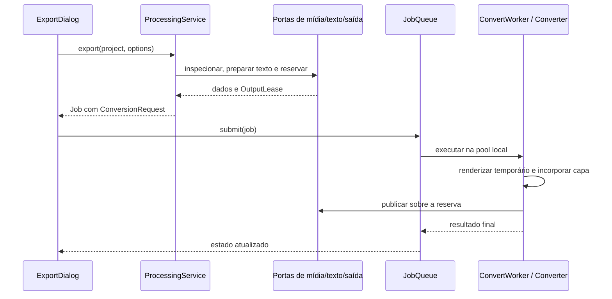

# Conversão e exportação

## Decisão na aplicação, execução no adaptador

`application/media/processing.py` contém `ProcessingService` e
`ExportOptions`. A apresentação coleta escolhas, solicita a preparação,
formata a descrição e submete o `Job` resultante à fila. Ela não constrói
argumentos ffmpeg nem reserva nomes por conta própria.

O serviço recebe três dependências: `MediaCatalog` para existência, inspeção
e permissão de escrita; `OutputStore` para a saída; e `TextRasterizer`
quando o projeto contém texto. No bootstrap, são `FFmpegCatalog`,
`FileOutputStore` e `QtTextRasterizer`.

## Converter um arquivo local

A inspeção gera `LocalMedia`, contendo duração, container e streams.
O painel usa `MediaWorker`/`ReadMedia` numa pool serial e recebe resultados por
token. Limpar a lista ou substituir o lote cancela a leitura e invalida respostas
anteriores. Para conversão, `require_duration=False` preserva a aceitação de
arquivos que não informam duração; o editor exige duração para clipes temporais.
`AudioTarget` descreve codec/qualidade de áudio; `VideoTarget` descreve
container, dimensões, codecs e demais escolhas de vídeo.

`convert` verifica a existência do tipo de stream solicitado, resolve a
pasta de saída e informa quando usou a pasta alternativa por falta de permissão.
Reserva o nome e devolve um pedido pronto. O worker recebe esse pedido e
`Converter` decide os argumentos concretos.

A política de compatibilidade em `domain/compatibility.py` decide quando
streams podem ser copiados e quando escala, codec ou container exigem
recodificação. O backend traduz essa decisão em argumentos. Descrições em
`application/media/conversion_description.py` explicam o resultado esperado.

### Regras da conversão local

Estas regras saíram de um checkup da conversão e têm teste em
`tests/test_conversion_checkup.py`:

- **Codec × container.** `container_accepts_video` diz se um codec escolhido
  cabe no container. A aba desabilita os que não cabem (H.264 e HEVC em `.webm`)
  e, se o atual deixa de caber, volta para "Copiar"; `ProcessingService.convert`
  recusa a combinação antes de enfileirar, em vez de deixar o erro cru do ffmpeg
  aparecer na fila. HEVC em MP4/MOV sai com a etiqueta `hvc1`, sem a qual não
  abre no QuickTime, em aparelhos Apple nem no app Filmes e TV.
- **Só vídeo de verdade.** O mapa é `0:V:0` (V maiúsculo exclui `attached_pic`),
  e `LocalMedia.video_is_cover` reconhece a capa embutida de áudio: sem isso um
  MP3 com capa "convertia" para um vídeo de um quadro.
- **Faixas extras.** O MKV mantém todas as faixas de áudio, os anexos (fontes
  de ASS) e as legendas — estas só quando todas são de um formato que ele aceita
  copiado; `mov_text` (a legenda do MP4) fica de fora. Os outros containers
  levam o primeiro vídeo e o primeiro áudio, e a
  descrição do plano avisa ("somente a 1ª faixa de áudio", "legendas não
  incluídas").
- **Resolução é o lado curto.** `display_size` aplica a rotação dos metadados;
  720p num vídeo retrato reduz a largura (`scale=720:-2`), e um vídeo gravado de
  lado é reconhecido como retrato.
- **WAV.** Só copia PCM que o muxer grava como está (`pcm_s16le`, `pcm_u8`;
  big-endian é recusado), e uma origem de 24 bits, 32 bits ou ponto flutuante
  sai em `pcm_s24le` — "sem perda" continua valendo.
- **Capa.** O remux que embute a capa mantém metadados e capítulos
  (`-map_metadata 0 -map_chapters 0`).
- **Processo.** O stderr do ffmpeg é lido em UTF-8 com `errors="replace"`: em
  cp1252 (o padrão do Windows) um caractere fora da tabela matava a thread que
  drena o cano, o cano enchia e o ffmpeg parava para sempre, segurando a única
  vaga da fila local.
- **Destino.** `FFmpegCatalog.writable` testa criar um arquivo na pasta
  (`os.access` só olha o atributo somente-leitura no Windows), e a publicação
  repete a troca algumas vezes quando o Windows a recusa por arquivo em uso
  (antivírus, indexador, OneDrive).
- **Estimativa.** Dimensões ausentes no ffprobe (streams quebrados, HLS) usam o
  padrão em vez de levantar `TypeError`.

## Exportar uma edição

`export` começa com `project.for_export()`, removendo da visão de exportação
o que não deve participar dela, e rejeita projeto vazio. Escolhe a referência
principal a partir da trilha de vídeo inferior visível, reaproveitando inspeção
em cache. Se não houver arquivo real, como num projeto somente com texto,
constrói uma referência para nome/pasta a partir do projeto salvo ou fallback.

A política `simple_trim` identifica quando a montagem ainda representa um
recorte simples da origem. O corte rápido só é preparado quando foi solicitado,
há uma única região elegível, mídia inspecionada, saída de vídeo e nenhuma
tela explicitamente configurada. Preserva o container da origem e usa o
keyframe anterior. Caso contrário, o serviço cria `Composition`.

`Composition` é um pedido sem comandos: projeto, container, família de codec,
hardware desejado, qualidade, interpolação e opções de áudio. O serviço
rasteriza os textos necessários antes de reservar a saída. Falha ao preparar
texto não deixa um placeholder para uma tarefa que não pode ser criada.

### GIF

O container `gif` tem caminho próprio em `composer.gif_args`: sem áudio, em
loop infinito e com a paleta de 256 cores montada a partir da própria edição —
nada de encoder de vídeo nem de placa. Uma paleta única para a animação inteira
dá o menor arquivo, mas obriga o ffmpeg a segurar todos os quadros até tê-los
visto (medido: 582 MB e 9,6 MB de arquivo num GIF de 30 s a 640×360, contra
116 MB e 15,5 MB da paleta por quadro). Acima de 512 MB estimados
(`quadros × largura × altura × 4`) a paleta passa a ser por quadro, de memória
constante. A janela de exportação esconde codec e qualidade, oferece taxas
baixas (10 a 25 q/s) e avisa que o som fica de fora.

## Corte rápido e corte exato

`domain/timing.py` contém segmentos, timecodes, modos de corte e cálculo do
keyframe anterior. `infrastructure/ffmpeg/trimmer.py` consulta os pacotes com
ffprobe e monta os comandos.

Corte rápido copia streams: a primeira imagem precisa de um keyframe.
A interface informa o início real e o desvio em relação à marca.
Corte exato recodifica para representar a marca solicitada.
Transformações, mudo, alteração de volume, adicionais e composição de trilhas
podem impedir a cópia direta, mesmo quando o vídeo parece um recorte simples.

`domain/export_policy.simple_trim` é a única fonte dessa decisão, e cada estado
que a cópia não saberia representar tira a edição do caminho de cópia: mais de
uma mídia, mídia ausente, mudo ou ganho, áudio separado, **velocidade,
opacidade ou quadros-chave**, tela ou taxa diferentes das do arquivo, várias
trilhas de vídeo com conteúdo, adicionais, posição/escala/rotação/chroma
diferentes do padrão, trilha oculta ou muda, **lacuna no começo ou entre
blocos** e blocos fora da ordem da origem. Antes, velocidade, opacidade,
animação e lacunas eram aceitos e o arquivo saía sem o efeito pedido, sem
aviso. GIF nunca é corte rápido: copiar os dados produziria o vídeo de entrada.

## Um compositor para todos os consumidores

`infrastructure/ffmpeg/composer.py` traduz o projeto em `Graph`, depois em
comandos de exportação, quadro parado, reprodução ou áudio. O algoritmo
compartilhado preserva as mesmas regras de montagem entre prévia e saída.

- Clipes são sobrepostos a um fundo, permitindo vãos pretos, tamanhos diferentes
  e camadas simultâneas.
- Cada peça traduz tempo da edição para tempo da origem, incluindo velocidade.
- Mixagem usa `amix` com `normalize=0`, preservando o ganho solicitado.
- Transformações, filtros, transições, chroma key e recursos de texto entram
  no grafo sem depender de widgets.
- Ajuste comum de fps não implica interpolação de movimento. `minterpolate`
  só entra quando solicitado e elegível.
- Quadros-chave viram expressões avaliadas pelo ffmpeg a cada quadro (ver
  [Animação no grafo](#animação-no-grafo)).

Os consumidores do mesmo grafo são: `export_args` (arquivo; `gif_args` para GIF),
`frame_command` (quadro parado, com `still=True`), `scrub_command` (trecho de
até 20 s em MJPEG para o cache da agulha), `interaction_commands` (fundo, objeto
e frente para o arrasto na prévia), `playback_command` (fluxo de reprodução) e
`audio_command` (PCM, com `until` para a emenda do loop). Veja
[prévia](previa.md) para o ciclo de cada um.

Nas transições, cada lado é montado pelo mesmo `_compose_video_piece` das
camadas normais, no relógio da timeline: conserva transformação, opacidade e
animação que o bloco tinha fora do corte. O alfa entra pré-multiplicado na
interpolação do `xfade`, a área externa de cada camada fica transparente (o
preto é só do canvas, então uma tarja superior não apaga o que está embaixo) e
os filtros usam intervalo semiaberto, para dois filtros consecutivos não
deixarem um quadro extra na fronteira. Quando duas passagens alcançam a mesma
trilha, a da trilha de vídeo mais alta controla o adicional uma única vez,
conservando sua posição na pilha.

O compositor lê as alças de mídia ao redor do ponto de saída do
clipe esquerdo e do ponto de entrada do direito. Sem alça suficiente, mantém o
quadro limite; a duração visual escolhida não é encurtada silenciosamente. O
vídeo usa `xfade`. O áudio anexado só usa `acrossfade` de potência constante
quando os dois arquivos têm amostras reais nas alças necessárias. Sem elas, o
corte de áudio é preservado e recebe apenas 12 ms de de-click, em vez de ser
preenchido com silêncio. Mudo do clipe, áudio separado e mudo da trilha são
resolvidos antes dessas curvas, portanto uma ponta muda nunca reaparece pela
transição. A prévia monta esse grafo diretamente na resolução visível para não
processar uma tela
4K que seria reduzida no fim; a exportação continua na resolução do projeto.

Quando o marcador habilita `transition_affects_additionals`, o compositor cria
duas subcomposições adicionais antes do `xfade`. Elas respeitam visibilidade e
ordem das trilhas, filtros e transformações de texto/imagem. Itens encerrados no
corte pertencem ao lado esquerdo, itens iniciados nele pertencem ao direito e
itens contínuos entram nos dois. Durante o intervalo da passagem, esses mesmos
itens são excluídos do fluxo principal para não serem desenhados outra vez por
cima do resultado. A duplicação de entradas só existe nessa opção explícita;
transições comuns preservam o caminho mais barato.

Um corte criado pela tesoura entre duas partes contínuas da mesma origem exige
tratamento próprio. Centralizar as duas entradas no mesmo ponto faria o `xfade`
misturar quadros idênticos e o efeito parecer ausente. O compositor percorre a
metade anterior no lado esquerdo e a metade posterior no direito, estendendo
cada uma pela duração da passagem. As extremidades continuam coincidindo com
o relógio normal, sem salto ao entrar ou sair do efeito. O áudio desse corte
permanece no fluxo principal, pois cruzar duas cópias sincronizadas da mesma
onda apenas aumentaria o volume sem criar uma passagem audível.

O compositor recebe um mapa de ID de clipe para PNG de texto. Não importa Qt
nem consulta renderizador global. Veja [prévia e texto](previa.md).

### Animação no grafo

`_keyframe_expr` converte os `Keyframe` de uma propriedade (`x`, `y`, `scale_x`,
`scale_y`, `rotation`, `opacity`) numa expressão `if(lt(t, …), …)` aninhada, no
relógio da timeline: o `time_offset` de cada ponto é somado à origem do bloco no
fluxo (`_clip_stream_origin`). Cada trecho usa a curva resolvida por
`resolve_segment_easing` — linear, τ², (2−τ)·τ, por partes para in-out, zero
para *hold* —, a rotação toma o menor caminho angular, e uma propriedade que não
varia vira um número literal, sem expressão.

- **Escala:** `scale=w=…:h=…:eval=frame`, com dimensões pares e mínimo de 2 px.
- **Rotação:** `rotate` cujo envelope (`ow`/`oh`) é dimensionado pela **maior
  escala** da animação (`max_diag`); sem isso os cantos seriam cortados nos
  ângulos intermediários.
- **Opacidade:** `geq` multiplica o alfa. O quadro entra em RGBA antes do
  redimensionamento dinâmico, e `_alpha_before_dynamic_scale` adianta o `geq`
  (levando o `chromakey` junto, que grava o alfa em vez de multiplicá-lo) para
  antes do `scale=…:eval=frame`: o `geq` fixa as dimensões do link quando é
  configurado, e depois de um `scale` que muda por quadro ele congelava justamente
  o tamanho que devia variar. O preset `zoom_in`, que anima escala e opacidade
  juntas, saía do arquivo com a imagem no tamanho do primeiro quadro-chave,
  enquanto a prévia — que monta um grafo por quadro — mostrava o movimento certo.
- **Posição:** expressões nas coordenadas do `overlay`
  (`x='round((expr)*W-w/2)'`), arredondadas como o Qt arredonda a geometria das
  alças (`_image_overlay_geometry`). `tests/test_preview_overlay_alignment.py`
  compara pixel a pixel contra a saída real do ffmpeg.

## Hardware, memória e exportação paralela

`application/encoding.py` descreve preferências e nomes neutros.
`infrastructure/ffmpeg/hardware.py` descobre o que funciona: listar um encoder
não comprova que a máquina consiga usá-lo. A sondagem codifica material pequeno,
armazena o resultado em cache e permite fallback para software.

A estimativa `domain/render_cost.py` usa custo calibrado por pixel para
interpolação; é uma estimativa conservadora, não memória medida em tempo real.
`system/memory.py` consulta disponibilidade da máquina.
`ffmpeg/parallel.py` usa custo, duração e recursos para decidir se dividir a
exportação interpolada vale a pena.

Quando há divisão, trechos de vídeo são renderizados separadamente, concatenados
e combinados com áudio produzido uma vez. O temporário fica junto ao destino:
evita usar um possível tmpfs grande e permite entrega por rename no mesmo volume.
Partes já consumidas são removidas. A capa é incorporada uma única vez, depois
da montagem final.

Conversões locais continuam serializadas na fila, mesmo quando uma exportação
usa trechos internos paralelos. A CPU sozinha não é critério suficiente para
aumentar concorrência: cada decodificador e filtro consome memória.

## Versões do ffmpeg

A máquina do usuário decide qual ffmpeg roda: o pacote traz o seu (7.1), mas no
Linux vale o instalado, e as versões em uso vão da 6 (Ubuntu 24.04) à 9
(Chocolatey). `binaries.major_version` lê esse número uma vez por executável, e
duas decisões dependem dele:

- **Grafo em arquivo.** Um projeto grande passa do limite da linha de comando,
  então o grafo vai para um arquivo temporário. A opção antiga
  (`-filter_complex_script`) saiu no ffmpeg 8; a nova (`-/filter_complex`, a
  forma genérica "o valor vem deste arquivo") entrou no 7. `command_assets`
  escolhe conforme a versão; usar a errada faz o ffmpeg recusar o comando
  inteiro. O arquivo é criado por `mkstemp` **para aquela chamada** e removido
  quando o processo consumidor sai, seja qual for o desfecho — nunca por
  varredura de extensão na pasta —, e o exportador serial, o paralelo e a
  montagem final passam pelo mesmo `filter_script`. Antes, cada exportação de
  grafo longo deixava um `.filter_script` órfão ao lado do destino.
- **`-pix_fmt` no VP9.** A composição chega com alfa, e do ffmpeg 9 em diante o
  `libvpx-vp9` recusa esse quadro em vez de convertê-lo: a exportação `.webm`
  terminava sem escrever nada. O formato agora é fixado como já era no x264 e
  no x265.

Uma limitação fica registrada: no ffmpeg 6, uma transição que atravessa um
adicional **com filtro** deixa o ramo do adicional sem quadros, e ele some
durante a transição. O agendamento interno que resolve isso chegou no ffmpeg 7.
Os testes desse caso são pulados quando a ferramenta é mais antiga. Os pacotes
(Windows e Linux) embutem o 7.1, então isso só alcança quem roda pelo
código-fonte com um ffmpeg antigo do sistema; a CI cobre as duas situações —
o ffmpeg da distribuição e o do pacote.

## Validação

Os testes existentes de compositor, converter, trimmer, exportação paralela e
integração continuam exercitando comandos e mídia real. Verificam duração,
streams, quadros, volume, transições e texto. Testes de preparação com portas
falsas ficam em `tests/application/test_media.py`; contratos de reserva ficam
em `tests/contracts/test_outputs.py`.

Mudanças no grafo devem ser verificadas pela saída. Uma string de comando
esperada não demonstra que a imagem, duração ou mixagem está correta.

Quando um trecho paralelo falha, a mensagem é a linha da cauda do stderr que
contém uma marca de falha (`error`, `invalid`, `failed`, `unable`, `cannot`,
`killed`, `out of memory`…). O ffmpeg despeja estatísticas ao encerrar mesmo
quando morre — "CPB properties: bitrate max/min/avg: 0/0/0" era a última linha —,
então, sem nenhuma marca, valem as duas últimas linhas com conteúdo.

Na junção final da exportação paralela, áudio e vídeo já foram limitados pelo
grafo do projeto. O remux copia todos os pacotes sem `-shortest`: a diferença
de duração dos pacotes AAC e a reordenação de B-frames podem fazer esse corte
adicional remover quadros válidos. A integração compara contagem de quadros,
duração, imagens distintas e volume com a saída serial.
