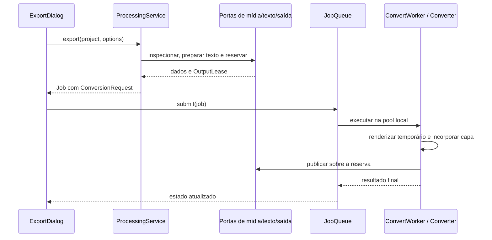

# Conversão e exportação

## Decisão na aplicação, execução no adaptador

`application/media/processing.py` contém `ProcessingService` e
`ExportOptions`. A apresentação coleta escolhas, solicita a preparação,
formata a descrição e submete o `Job` resultante à fila. Ela não constrói
argumentos ffmpeg nem reserva nomes por conta própria.

O serviço recebe três dependências: `MediaCatalog` para existência, inspeção
e permissão de escrita; `OutputStore` para a saída; e `TextRasterizer`
quando o projeto contém texto. No bootstrap, são `FFmpegCatalog`,
`FileOutputStore` e `QtTextRasterizer`.

## Converter um arquivo local

A inspeção gera `LocalMedia`, contendo duração, container e streams.
O painel usa `MediaWorker`/`ReadMedia` numa pool serial e recebe resultados por
token. Limpar a lista ou substituir o lote cancela a leitura e invalida respostas
anteriores. Para conversão, `require_duration=False` preserva a aceitação de
arquivos que não informam duração; o editor exige duração para clipes temporais.
`AudioTarget` descreve codec/qualidade de áudio; `VideoTarget` descreve
container, dimensões, codecs e demais escolhas de vídeo.

`convert` verifica a existência do tipo de stream solicitado, resolve a
pasta de saída e informa quando usou a pasta alternativa por falta de permissão.
Reserva o nome e devolve um pedido pronto. O worker recebe esse pedido e
`Converter` decide os argumentos concretos.

A política de compatibilidade em `domain/compatibility.py` decide quando
streams podem ser copiados e quando escala, codec ou container exigem
recodificação. O backend traduz essa decisão em argumentos. Descrições em
`application/media/conversion_description.py` explicam o resultado esperado.

## Exportar uma edição

`export` começa com `project.for_export()`, removendo da visão de exportação
o que não deve participar dela, e rejeita projeto vazio. Escolhe a referência
principal a partir da trilha de vídeo inferior visível, reaproveitando inspeção
em cache. Se não houver arquivo real, como num projeto somente com texto,
constrói uma referência para nome/pasta a partir do projeto salvo ou fallback.

A política `simple_trim` identifica quando a montagem ainda representa um
recorte simples da origem. O corte rápido só é preparado quando foi solicitado,
há uma única região elegível, mídia inspecionada, saída de vídeo e nenhuma
tela explicitamente configurada. Preserva o container da origem e usa o
keyframe anterior. Caso contrário, o serviço cria `Composition`.

`Composition` é um pedido sem comandos: projeto, container, família de codec,
hardware desejado, qualidade, interpolação e opções de áudio. O serviço
rasteriza os textos necessários antes de reservar a saída. Falha ao preparar
texto não deixa um placeholder para uma tarefa que não pode ser criada.

## Corte rápido e corte exato

`domain/timing.py` contém segmentos, timecodes, modos de corte e cálculo do
keyframe anterior. `infrastructure/ffmpeg/trimmer.py` consulta os pacotes com
ffprobe e monta os comandos.

Corte rápido copia streams: a primeira imagem precisa de um keyframe.
A interface informa o início real e o desvio em relação à marca.
Corte exato recodifica para representar a marca solicitada.
Transformações, mudo, alteração de volume, adicionais e composição de trilhas
podem impedir a cópia direta, mesmo quando o vídeo parece um recorte simples.

## Um compositor para todos os consumidores

`infrastructure/ffmpeg/composer.py` traduz o projeto em `Graph`, depois em
comandos de exportação, quadro parado, reprodução ou áudio. O algoritmo
compartilhado preserva as mesmas regras de montagem entre prévia e saída.

- Clipes são sobrepostos a um fundo, permitindo vãos pretos, tamanhos diferentes
  e camadas simultâneas.
- Cada peça traduz tempo da edição para tempo da origem, incluindo velocidade.
- Mixagem usa `amix` com `normalize=0`, preservando o ganho solicitado.
- Transformações, filtros, transições, chroma key e recursos de texto entram
  no grafo sem depender de widgets.
- Ajuste comum de fps não implica interpolação de movimento. `minterpolate`
  só entra quando solicitado e elegível.

O compositor recebe um mapa de ID de clipe para PNG de texto. Não importa Qt
nem consulta renderizador global. Veja [prévia e texto](previa.md).

## Hardware, memória e exportação paralela

`application/encoding.py` descreve preferências e nomes neutros.
`infrastructure/ffmpeg/hardware.py` descobre o que funciona: listar um encoder
não comprova que a máquina consiga usá-lo. A sondagem codifica material pequeno,
armazena o resultado em cache e permite fallback para software.

A estimativa `domain/render_cost.py` usa custo calibrado por pixel para
interpolação; é uma estimativa conservadora, não memória medida em tempo real.
`system/memory.py` consulta disponibilidade da máquina.
`ffmpeg/parallel.py` usa custo, duração e recursos para decidir se dividir a
exportação interpolada vale a pena.

Quando há divisão, trechos de vídeo são renderizados separadamente, concatenados
e combinados com áudio produzido uma vez. O temporário fica junto ao destino:
evita usar um possível tmpfs grande e permite entrega por rename no mesmo volume.
Partes já consumidas são removidas. A capa é incorporada uma única vez, depois
da montagem final.

Conversões locais continuam serializadas na fila, mesmo quando uma exportação
usa trechos internos paralelos. A CPU sozinha não é critério suficiente para
aumentar concorrência: cada decodificador e filtro consome memória.

## Validação

Os testes existentes de compositor, converter, trimmer, exportação paralela e
integração continuam exercitando comandos e mídia real. Verificam duração,
streams, quadros, volume, transições e texto. Testes de preparação com portas
falsas ficam em `tests/application/test_media.py`; contratos de reserva ficam
em `tests/contracts/test_outputs.py`.

Mudanças no grafo devem ser verificadas pela saída. Uma string de comando
esperada não demonstra que a imagem, duração ou mixagem está correta.

Na junção final da exportação paralela, áudio e vídeo já foram limitados pelo
grafo do projeto. O remux copia todos os pacotes sem `-shortest`: a diferença
de duração dos pacotes AAC e a reordenação de B-frames podem fazer esse corte
adicional remover quadros válidos. A integração compara contagem de quadros,
duração, imagens distintas e volume com a saída serial.
