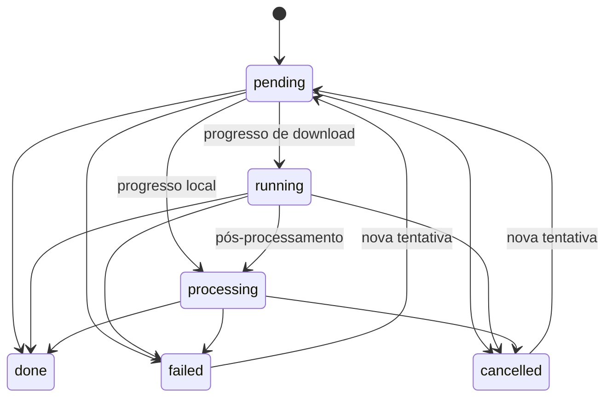

# Tarefas, concorrência e cancelamento

## Dados e propriedade

`application/jobs/models.py` define `Job`, `JobKind` e `JobStatus`.
`JobService` é o proprietário das transições. `Job` é um registro mutável
observado pela apresentação; estados devem ser alterados pelo serviço.

| Pedido de jobs/requests.py | Dados |
| --- | --- |
| `DownloadRequest` | Seleção, mídia normalizada, destino, temporário e preferências capturadas. |
| `ConversionRequest` | Mídia inspecionada, alvo, destino, recursos de texto e reserva da saída. |
| Alvo de conversão | `AudioTarget`, `VideoTarget`, `TrimTarget` ou `Composition`. |

Os pedidos são dataclasses congeladas. As preferências são copiadas antes de
enfileirar: Configurações não deve mudar um download já criado.
`Preferences` é um DTO mutável para edição; a cópia num pedido não deve ser
alterada. Ela é omitida do `repr` do pedido.

Não existe `Job.opts`. Expressões, argumentos e pós-processadores são
construídos dentro dos adaptadores.

## Estados e tentativas

`ProgressStage` diferencia download e processamento. O texto de `phase`
serve à exibição, sem comandar estados. `JobStatus` usa códigos estáveis;
`strings.JOB_STATUS_LABELS` e o painel da fila apresentam rótulos em pt-BR.

Cada `begin` incrementa `attempt_id` e limpa progresso, resultado, erro e
log anteriores. Um evento só é aceito se pertence à tentativa atual e a tarefa
ainda não terminou. Progresso atrasado não ressuscita uma tarefa final; um
cancelamento anterior não cancela a repetição.

## Adaptador Qt

`infrastructure/qt/workers/queue.py` conecta o serviço às pools:

- Downloads usam `max_concurrent_jobs`.
- Conversões, cortes e exportações usam uma pool local com uma vaga.
- O editor mantém pools próprias para prévia/reprodução e trabalho de fundo,
  evitando que miniaturas bloqueiem uma busca.

`JobQueue` cria o worker, mantém suas referências e conecta um receptor
`_Attempt` com afinidade à thread principal. Os sinais entregam eventos ao
serviço nessa thread. O receptor mantém a identidade da tentativa até esvaziar
os sinais já enfileirados.

Falha ao construir o worker termina a tentativa e libera sua reserva.
Repetir uma conversão reserva novo destino e substitui o pedido pelo serviço.
Se a reserva falhar, a tarefa apresenta a causa.

`presentation/qt/tasks.py` contém `WorkerRunner`, usado fora da fila
visível. Mantém referências aos `QRunnable` até o sinal final e coordena
cancelamento. É um mecanismo de ciclo de vida da interface, sem regras de mídia.

## Cancelar a operação

O cancelamento alcança o worker e seus processos registrados.
`system/process.py` oferece prazos, consulta de cancelamento e encerramento.
Conversor e exportador paralelo protegem também o intervalo entre abrir e
registrar um processo, para não deixar ffmpeg rodando sem dono.

Conversões e trechos paralelos enviam terminate imediatamente e aguardam
fora da interface. Após 200 ms sem encerramento, o filho recebe kill e é
coletado. Falhas no callback de progresso também percorrem a limpeza.

Análise yt-dlp usa cancelamento cooperativo: seu resultado deixa de ser aceito,
mas uma chamada de rede em andamento pode terminar depois. O receptor da análise
confere a identidade do worker antes de atualizar a mídia ou mostrar um erro.

No fechamento, janela, editor e fila solicitam cancelamento e aguardam pools
dentro dos prazos definidos. Não adicionar processos desvinculados desse fluxo.

## Reserva e publicação

`OutputStore` é a porta da aplicação.
`FileOutputStore.reserve` cria um placeholder vazio com nome exclusivo,
usando `O_EXCL`, e retorna `OutputLease`: caminho, dispositivo e identidade
do arquivo. Dois pedidos do mesmo nome recebem reservas diferentes.

O processamento grava num temporário exclusivo ao lado do destino.
`mkstemp` impede colisão do arquivo serial com outras operações; o exportador
paralelo usa um diretório temporário próprio. A capa é incorporada
nesse temporário, quando aplicável. Só então o adaptador confere a reserva e
publica por substituição atômica.

Cancelamento e publicação são ordenados pelo mesmo lock do executor:

- Cancelamento anterior impede a publicação.
- Publicação anterior mantém o sucesso.
- A limpeza remove somente o placeholder ainda pertencente à tarefa, nunca
  uma saída concluída ou um arquivo colocado ali por outra operação.

A API direta do conversor aceita destino sem lease para consumidores locais;
o fluxo da aplicação fornece a reserva. Esse contrato é das conversões e
exportações. Downloads preservam o controle de nomes, temporários e
pós-processamento do yt-dlp.

Os testes de aplicação cobrem transições sem Qt. Os contratos cobrem propriedade
de arquivos; a integração cancela durante a capa e confere ausência de resíduos.
