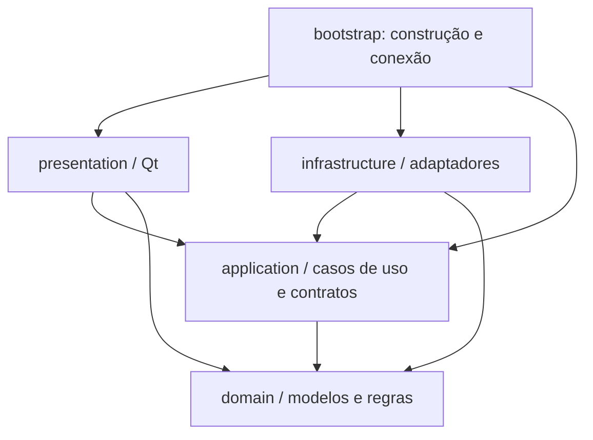

# Plano de migração para Clean Architecture

**Estado:** plano executado na base de código, em 7 de setembro de 2026;
ver [entregas e limites de validação](clean-architecture/migracao.md).
**Base inspecionada:** commit `e2e91d0` (`correcao de bugs`).
O restante deste documento preserva a proposta original e seus critérios,
incluindo os caminhos antigos usados como evidência. A implementação atual está
em [arquitetura.md](arquitetura.md) e no [guia completo](clean-architecture/README.md).
O `AGENTS.md` permanece uma visão geral do projeto. A validação nativa Windows
depende da execução no sistema de destino; não foi certificada pelo build Linux.

## 1. Objetivo e escopo

Separar regras de edição e mídia, coordenação das funcionalidades, interface
gráfica e ferramentas externas. A meta é conseguir testar os casos de uso sem
iniciar Qt, yt-dlp ou ffmpeg, mantendo testes reais das integrações.

A proposta mantém Python 3.10+, PySide6, yt-dlp, ffmpeg/ffprobe, o aplicativo
desktop e o empacotamento para Windows e Linux. Uma mudança para C++ ou Rust
seria outra iniciativa. Esta migração não exige serviços, banco de dados,
framework de injeção de dependências ou mudança de interface visual.

O princípio adotado é a regra de dependência: o código das camadas internas
não conhece implementações nem tipos das camadas externas. Interfaces definidas
pela aplicação permitem chamar essas implementações em execução. A quantidade
de pastas deve atender ao projeto, sem reproduzir círculos mecanicamente.
Referência: [The Clean Architecture, de Robert C. Martin](https://blog.cleancoder.com/uncle-bob/2012/08/13/the-clean-architecture.html).

O benefício esperado é manutenção, isolamento de falhas e facilidade de teste.
Não há promessa de acelerar processamento de vídeo: ele continuará no ffmpeg.
Tempos de prévia, inicialização e consumo de memória devem ser acompanhados para
evitar regressões causadas pela própria reorganização.

## 2. Ponto de partida

A separação atual em `core`, `workers` e `ui` é uma base aproveitável, mas
`core` contém tanto regras quanto integração e persistência. Estar livre de
imports de Qt não equivale a ser independente de infraestrutura.

| Evidência no código atual | Consequência para a migração |
| --- | --- |
| `core/project.py` importa constantes de `trimmer.py`, que também executa ferramentas externas. | Extrair conceitos compartilhados para o domínio antes de mover o projeto. |
| `core/converter.py` reúne modelos de mídia, compatibilidade, ffprobe, reserva de saída e execução de ffmpeg. | Dividir responsabilidades; mover o arquivo inteiro perpetuaria o acoplamento. |
| `core/job.py` importa `Progress` de `downloader.py`; `Job.opts` recebe dicionários heterogêneos. | Criar progresso independente do provedor e pedidos tipados por operação. |
| `workers/queue.py` combina estado das tarefas, regras de concorrência, construção de workers e sinais Qt. | Separar serviço de tarefas e adaptador de execução. |
| `ui/export_dialog.py` monta `Composition`/`TrimTarget`, resolve ferramentas e reserva o destino. | Transferir preparação e submissão da exportação para casos de uso. |
| `ui/editor_project.py` acessa estado privado do painel; `workers/media_worker.py` coordena leitura e importação. | Dar à aplicação a propriedade da sessão e do ciclo de vida dos projetos. |
| `core/selector.py` mistura seleção de mídia com a sintaxe do yt-dlp; `format_matrix.py` interpreta dicionários do extrator. | Separar políticas neutras de normalização e tradução específicas do provedor. |
| `core/text_assets.py` usa um renderizador global mutável configurado pelo Qt. | Injetar o renderizador na instância que precisa dele. |
| As fixtures automáticas de `tests/conftest.py` inicializam Qt e importam a interface em toda a suíte. | Isolar fixtures gráficas para comprovar a independência dos testes internos. |

Devem ser reaproveitados o modelo imutável de projeto, histórico de edição,
grafo de composição compartilhado, controle de subprocessos, fixtures de
extratores e testes de mídia. A migração reorganiza esses mecanismos sem
reescrever seus algoritmos simultaneamente.

## 3. Arquitetura de destino

As setas representam **dependências de código**, não a ordem de execução:



`application` chama portas próprias; `bootstrap` entrega implementações de
`infrastructure`. A interface chama casos de uso e recebe resultados e eventos,
sem construir gateways. Acesso de leitura a modelos imutáveis do domínio é
permitido; a UI não altera a sessão nem executa regras de negócio diretamente.

Estrutura sugerida, a ser criada conforme cada funcionalidade migrar:

```text
src/videomanager/
├── __main__.py                 # ponto de entrada preservado
├── app.py                      # inicialização desktop
├── bootstrap.py                # montagem explícita das dependências
├── domain/
│   ├── project.py              # projeto, trilhas, clipes e operações puras
│   ├── media.py                # mídia normalizada, streams e alvos
│   ├── policies/               # seleção, compatibilidade, corte, estimativas
│   └── errors.py               # violações de regras
├── application/
│   ├── editor/                 # sessão, abrir, importar, editar, salvar
│   ├── jobs/                   # submissão, estados, cancelamento, repetição
│   ├── media/                  # análise, conversão, exportação e prévia
│   ├── ports/                  # contratos externos exigidos pelos casos de uso
│   ├── dto.py                  # pedidos e resultados compartilhados
│   └── events.py               # progresso e eventos tipados
├── infrastructure/
│   ├── ffmpeg/                # probe, comandos, composição, prévia, encoders
│   ├── yt_dlp/                # extração, normalização, seletores, download
│   ├── storage/               # projetos JSON, preferências, saídas, caches
│   ├── system/                # processos, binários, recursos da máquina
│   └── qt/                    # executor, despacho, áudio e rasterização
├── presentation/
│   └── qt/                    # janelas, widgets, controllers, presenters
└── resources/                 # fontes e ícones existentes
```

Os nomes indicam responsabilidades, não uma obrigação de criar um arquivo por
classe. Preferir funções para regras puras, dataclasses para dados e
`typing.Protocol` para fronteiras que precisam de substituição em testes.

### Responsabilidade de cada camada

- **Domínio:** invariantes de clipes, trilhas e projeto; tempos, efeitos e
  compatibilidade semântica entre mídia e alvo. Sem leitura de arquivos,
  processos, Qt, JSON de projeto ou opções de yt-dlp/ffmpeg.
- **Aplicação:** sessão de edição, casos de uso, pedidos de processamento,
  política de fila e coordenação de cancelamento. Usa apenas domínio,
  biblioteca padrão e portas próprias. Caminhos podem ser valores `Path`;
  acessar o arquivo correspondente é responsabilidade de um adaptador.
- **Infraestrutura:** executa as operações externas, traduz formatos e erros,
  gerencia recursos e implementa as portas. Detalhes compartilhados entre
  adaptadores podem ficar nesta camada, sem subir para o domínio.
- **Apresentação:** interpreta ações, coleta escolhas, apresenta resultados e
  mantém estado estritamente visual, como seleção, zoom e posição dos painéis.
  Formatação de rótulos, mensagens e unidades fica aqui.
- **Inicialização:** constrói serviços, gateways, executores e janelas; define
  seus tempos de vida e encerramento. `app.py` e `bootstrap.py` são os locais
  autorizados a conhecer todas as camadas.

### Contratos iniciais

Introduzir cada porta quando seu primeiro caso de uso for migrado:

| Porta ou contrato | Responsabilidade e limite |
| --- | --- |
| `ProjectRepository` | Ler e salvar um projeto; retornar também informações sobre referências ausentes. Detalhes de JSON e caminhos relativos ficam no adaptador. |
| `MediaProbe` | Inspecionar mídia local e devolver descritores neutros; sem expor a resposta crua do ffprobe. |
| `DownloadGateway` | Analisar URLs e executar um pedido de download. Normalizar dados do provedor na entrada; traduzir escolhas na saída. |
| `MediaProcessor` | Executar conversão/exportação tipada. Comandos, filtros, encoders e segmentação paralela ficam no adaptador ffmpeg. |
| `PreviewRenderer` | Produzir quadros, miniaturas, formas de onda e fluxos de prévia com identificadores de requisição e cancelamento. |
| `OutputStore` | Reservar destino, fornecer área temporária, publicar resultado e abortar a reserva pertencente à operação. |
| `SettingsRepository` | Ler/gravar preferências tipadas, preservando locais e compatibilidade atuais. |
| `TaskExecutor` e `EventDispatcher` | Executar trabalho fora da thread da UI e devolver eventos ao responsável pelo estado. Sem tipos Qt no contrato. |
| `TextRasterizer` e `AudioOutput` | Rasterizar texto e reproduzir PCM/consultar relógio. Definir apenas o necessário aos fluxos de renderização e reprodução. |

Preferências de aplicação, como concorrência, entram como valores. Disponibilidade
de encoders e ferramentas entra como capacidades consultadas por adaptadores.
Argumentos de ffmpeg e `postprocessors` do yt-dlp não atravessam essas portas.
Uma configuração exclusiva do provedor fica no adaptador, não num dicionário
genérico acessível por todas as camadas.

Substituir `Job.opts` por pedidos como `DownloadRequest`, `ConversionRequest` e
`ExportRequest`, com resultados e falhas tipados. Eventos de progresso carregam
fase, unidades, percentual quando conhecido, `job_id` e `attempt_id`; o presenter
traduz fases e estados em textos de `strings.py`. Não inferir estado a partir
de frases como “Baixando”. Erros internos carregam categoria e contexto seguro;
o adaptador traduz exceções externas e a apresentação produz a mensagem em pt-BR.

## 4. Destino dos módulos existentes

Todos os caminhos de origem abaixo são relativos a `src/videomanager/`.

| Origem | Destino e divisão necessária |
| --- | --- |
| `core/project.py` | `domain/project.py`; extrair constantes e tipos hoje obtidos de módulos de processamento. |
| `core/editor_session.py` | `application/editor/`; encapsular histórico, ponto salvo e aplicação de comandos. |
| `core/models.py`, modelos de `converter.py` | Modelos neutros em `domain/media.py`; dados de provedor no adaptador; rótulos em presenters. |
| `core/format_matrix.py`, `selector.py` | Políticas independentes em `domain/policies/`; leitura dos dicionários, IDs opacos de formatos e expressões yt-dlp em `infrastructure/yt_dlp/`. |
| `core/probe.py`, `downloader.py` | Gateway yt-dlp; progresso e resultados definidos pela aplicação. |
| `core/converter.py`, `trimmer.py` | Regras semânticas no domínio, coordenação na aplicação, probe/comandos/processamento no adaptador ffmpeg. |
| `core/composer.py` | Grafo de filtros no adaptador ffmpeg; separar pedido semântico de exportação das opções técnicas do backend. |
| `core/preview.py`, `parallel_export.py`, `thumbnail.py` | Implementações ffmpeg; política de submissão na aplicação e execução segmentada limitada no backend. |
| `core/project_io.py`, `settings.py` | Repositórios em `infrastructure/storage/`; tipos de preferências pertencem à aplicação ou à apresentação, conforme seu uso. |
| `core/binaries.py`, `process.py`, `memory.py`, `hwaccel.py` | Sistema e ffmpeg; estimativas puras podem receber capacidades como entrada, sem sondar a máquina. |
| `core/estimator.py`, `humanize.py`, `errors.py` | Separar cálculo puro, consulta externa, formatação visual e erros de domínio/aplicação/integração. |
| `core/job.py`, `workers/queue.py` | Serviço de tarefas em `application/jobs/`; execução Qt e despacho em `infrastructure/qt/`. |
| Demais `workers/` | Casos de uso absorvem a coordenação; adaptadores Qt conservam apenas execução, sinais e gerenciamento de referências. |
| `ui/editor_project.py`, `ui/panels/edit_panel.py` | Casos de uso e sessão na aplicação; controllers/presenters e widgets na apresentação. Eliminar acesso cruzado a `panel._...`. |
| `ui/export_dialog.py`, `main_window.py`, demais painéis | Views/controllers; dependências concretas saem para `bootstrap.py`. |
| `core/text_assets.py`, `ui/text_renderer.py`, `ui/audio_preview.py` | Contratos necessários à aplicação e adaptadores Qt injetados. Eliminar o registro global do renderizador. |
| `ui/strings.py`, `theme.py`, `fonts.py`, `icons.py` | Apresentação Qt, com acesso aos recursos fornecido na inicialização quando necessário. |

## 5. Fluxos e propriedade do estado

### Projeto e sessão do editor

`OpenProject`, `ImportMedia`, `SaveProject`, `ApplyEdit`, `Undo` e `Redo`
coordenam operações sobre uma única `EditorSession`. A UI recebe snapshots
imutáveis e eventos; não obtém listas mutáveis de histórico nem atribui
diretamente o projeto atual. Preservar as identidades e o limite atual de 60
entradas de histórico.

Abertura/importação ocorre em segundo plano: ler, inspecionar referências e
produzir um resultado. A aplicação só instala o resultado se a requisição ainda
for válida para a sessão atual. Uma abertura cancelada ou antiga não substitui
um projeto aberto posteriormente. Mídias ausentes/rejeitadas continuam sendo
informadas de forma recuperável.

No salvamento, capturar projeto, sessão e destino antes da escrita. Após sucesso,
marcar como salvo o snapshot efetivamente gravado, apenas na sessão correspondente.
Edições posteriores ao início da operação devem continuar pendentes. Serializar
salvamentos concorrentes para o mesmo destino, impedindo que uma gravação antiga
sobrescreva uma nova. A gravação mantém o protocolo atômico do repositório.

### Conversão e exportação

1. O controller entrega escolhas e snapshot à preparação do caso de uso.
2. A aplicação valida referências e regras, solicita capacidades quando preciso
   e devolve plano, estimativas e avisos. Abrir/alterar o diálogo não reserva saída.
3. Ao submeter, a aplicação reserva o destino pela porta e registra o pedido
   tipado na fila. Se o registro falhar, a reserva é desfeita.
4. O executor chama o processamento com pedido imutável, progresso e cancelamento.
   O adaptador ffmpeg usa o mesmo construtor de composição para prévia e exportação.
5. O resultado é finalizado, incluindo capa opcional uma única vez, antes da
   publicação atômica. O serviço registra o estado final e emite um evento.
6. Falha/cancelamento libera temporários e a reserva da tentativa; nova tentativa
   recebe novo identificador e uma reserva válida, sem reutilizar handles antigos.

O contrato de saída deve cobrir tanto o nome escolhido antecipadamente em uma
conversão quanto o nome resolvido pelo download. Não impor ao yt-dlp um fluxo de
renomeação que altere extensões negociadas ou perca arquivos auxiliares. Cada
adaptador identifica o conjunto de arquivos que criou e pode limpar com segurança.

### Execução, cancelamento e reprodução

- O serviço de tarefas e a sessão têm um único responsável por suas mutações.
  No desktop, eventos retornam à thread principal pelo `EventDispatcher` Qt;
  testes podem usar um dispatcher síncrono. Workers não modificam esses objetos.
- Pedidos de I/O/processamento são executados fora da thread principal; comandos
  curtos sobre o modelo imutável podem ser aplicados nela. Não criar um event loop
  adicional nem um segundo sistema de filas durante a migração.
- Preservar pools distintas: downloads configuráveis, processamento local com
  uma vaga, prévia/reprodução e trabalho de fundo do editor. O paralelismo de
  segmentos ffmpeg continua subordinado ao limite de recursos do backend.
- Cada tentativa produz um único resultado terminal. Eventos atrasados são
  rejeitados por tentativa/requisição; progresso não reabre tarefa concluída.
  Cancelamento anterior à publicação impede a entrega; publicação já concluída
  mantém sucesso, mesmo se o pedido de cancelamento chegar depois.
- O cancelamento da aplicação não expõe `Popen`, `QRunnable` ou sinais. Os
  adaptadores encerram e aguardam processos, inclusive pós-processamento, e
  liberam referências aos workers. O encerramento do aplicativo segue esse contrato.
- Prévia transporta buffers e metadados neutros, com tamanho e descarte definidos;
  `QImage`, `QPixmap` e `QAudioSink` ficam nos adaptadores/apresentação Qt. Preservar
  áudio como relógio, descarte de quadros obsoletos e caches. Não copiar a sessão
  inteira a cada quadro nem acumular buffers sem limite.
- O adaptador de texto declara seu ciclo de vida e restrições de thread. Fontes
  são inicializadas antes do uso; a troca do registro global por injeção não
  autoriza acessar widgets ou recursos Qt de threads inadequadas.

## 6. Etapas de implementação

Cada etapa deve terminar com o aplicativo executável e testes relevantes
aprovados. Os tamanhos abaixo indicam complexidade relativa, não prazo.

| Etapa | Entregas | Critério de conclusão | Porte |
| --- | --- | --- | --- |
| **0 — Linha de base e proteção** | Registrar suíte, fluxos manuais, saídas de mídia e medições; separar fixtures Qt; adicionar verificação de dependências para pacotes novos. | Testes internos deixam de inicializar Qt; comportamento atual registrado; mapa de exceções legadas explícito. | Pequeno |
| **1 — Domínio e montagem** | Extrair modelos/regras puros, constantes compartilhadas, progresso e contratos mínimos; introduzir `bootstrap.py`; criar encaminhamentos de imports antigos quando necessários. | Domínio não depende de `core`, Qt, yt-dlp ou ferramentas externas; modelos preservam identidade/igualdade e testes existentes. | Médio |
| **2 — Projeto e sessão: primeiro fluxo completo** | Implementar abrir/importar/salvar, edição e undo/redo; adaptar JSON e probe; substituir a coordenação de `editor_project.py` e `media_worker.py`; expor API pública do editor. | Casos de uso testáveis com portas falsas; `.vmp` compatível; histórico e ponto salvo corretos; nenhum resultado obsoleto instalado. | Médio |
| **3 — Fila e execução** | Extrair serviço de tarefas, pedidos/resultados tipados, dispatcher e executor; preservar pools e mapear eventos para a UI. | Um único dono dos estados; repetição, cancelamento e fechamento verificados; eliminar `Job.opts` dos fluxos migrados. | Alto |
| **4 — Conversão e exportação** | Extrair processamento ffmpeg, preparação, reservas e publicação; retirar construção de jobs do diálogo; injetar rasterização onde o compositor já precisar dela. | Mídias reais equivalentes; corte rápido/exato e avisos preservados; sem colisões, resíduos ou capa duplicada; prévia usa o mesmo compositor. | Alto |
| **5 — Downloads e análise de URL** | Migrar gateway yt-dlp, normalização, políticas e tradução de seletores; mover coordenação dos painéis e workers. | Fixtures offline e parser real do yt-dlp passam; playlists, formatos incompletos, áudio, metadados, cookies e avisos mantêm os contratos. | Médio |
| **6 — Prévia, áudio e restante do editor** | Migrar renderer, reprodução, caches e controller; concluir injeção de texto/áudio e remover registro global; deixar painel e timeline com funções de apresentação. | Busca, reprodução, sincronismo, texto e tela cheia preservados; memória/latência sem regressão repetível não explicada; descarte/cancelamento correto. | Alto |
| **7 — Consolidação e distribuição** | Concluir preferências, provisionamento e capacidades; remover adaptadores temporários e imports antigos; atualizar documentação, CI e empacotamento. | Todas as regras arquiteturais obrigatórias; aplicação e pacotes Linux/Windows validados; `core/workers/ui` antigos removidos quando sem consumidores. | Médio |

Dependências: `0 → 1 → 2 → 3 → 4 → 5 → 6 → 7` é a ordem recomendada para este
projeto. A etapa 4 já deve fornecer a injeção de texto exigida pelo novo backend;
a etapa 6 conclui os consumidores restantes. Preferências e descoberta de
ferramentas ganham adaptadores mínimos quando necessárias às etapas anteriores,
sem aguardar a consolidação final.

Dividir etapas grandes em PRs por comportamento: preparação antes de execução,
execução antes da remoção do caminho antigo. Cada PR declara quais fluxos já
usam as novas camadas e quais permanecem no legado. Evitar juntar reorganização,
otimização de algoritmos e novas funcionalidades numa mesma revisão.

### Primeira entrega concreta

Começar pela etapa 0 e pela extração mínima necessária ao editor: isolar fixtures
gráficas, proteger imports, remover a dependência de `Project` em `trimmer`,
definir `ProjectRepository`/`MediaProbe` e montar as dependências no bootstrap.
O primeiro fluxo funcional migrado será abrir/salvar projeto e atualizar a sessão.
Ele valida as fronteiras com menos risco do que começar pelo processamento de vídeo.

## 7. Estratégia de transição

Mover por responsabilidade, não por renomeação em massa. Enquanto os
consumidores antigos existirem, módulos antigos podem reexportar definições
novas: a direção temporária é **legado → novo**. `domain` e `application` nunca
importam `core`, `workers` ou `ui`, nem mesmo apenas para anotações de tipo.

Adaptadores temporários em `infrastructure/legacy/` podem envolver funções atuais
atrás das portas. Cada adaptador deve ter consumidor, etapa de remoção e testes
identificados. Isso não autoriza ciclos: o legado envolvido não pode importar o
serviço que o chama. Deve existir uma única implementação ativa de cada fluxo e
uma única fila responsável por cada tarefa.

Preservar extensão e esquema `.vmp` versão 1, IDs, caminhos relativos, tratamento
de mídias ausentes, preferências e destinos de arquivos. O novo repositório deve
ler projetos existentes e produzir arquivos que a versão anterior consiga ler.
Nenhuma migração de dados é necessária por causa da mudança de arquitetura.

Preservar o ponto de entrada e a preparação do ambiente de subprocessos hoje em
`binaries.subprocess_kwargs()`, inclusive bibliotecas do PyInstaller e consoles
no Windows. Não duplicar essa lógica em cada adaptador.

Se uma etapa falhar na validação, corrigir ou reverter seu PR antes de avançar.
A compatibilidade de arquivos permite retornar ao executável anterior; não manter
implementações duplicadas indefinidamente como mecanismo de recuperação.

## 8. Validação e critérios de aceite

### Testes por fronteira

| Grupo proposto | O que comprovar |
| --- | --- |
| `tests/domain/` | Operações de edição, compatibilidade, seleção e estimativas sem UI, rede ou processos. |
| `tests/application/` | Sessão, fluxo de casos de uso, estados, cancelamento, conflitos e falhas usando portas falsas. Sem `QApplication`. |
| `tests/contracts/` | Mesma semântica entre implementações falsas e reais: erros, resultados, cancelamento e propriedade dos recursos. |
| `tests/infrastructure/` | Leitura/escrita real, ffprobe/ffmpeg, extração normalizada, seletores, publicação e processos. |
| `tests/presentation/` | Controllers/presenters e integração Qt offscreen; fixtures de áudio e aplicação restritas aos testes que precisam delas. |
| `tests/architecture/` | Imports permitidos, dependências transitivas, ausência de ciclos e de acessos ao legado nas camadas internas. |

Os testes arquiteturais devem considerar imports relativos, `from pacote import
modulo`, reexportações e `TYPE_CHECKING`. Proibir PySide6, yt-dlp, platformdirs,
subprocess e módulos externos do projeto nas camadas internas. Bibliotecas
externas de teste não contam como dependências do código de produção.
Executar domínio/aplicação também em ambiente com Python e pytest, sem instalar
dependências desktop, usando `PYTHONPATH=src`; mover fixtures é parte desse aceite.

Preservar testes com resultados reais: duração, streams, codecs, volume,
quadros, transições, texto, PCM e arquivos publicados. Comparar comandos do
ffmpeg, sozinho, não demonstra equivalência. Manter casos com `vcodec="none"`
e codec ausente, filtros tolerantes a metadados ausentes e avisos de substituição
sem recodificação silenciosa. Testes de rede continuam separados e opcionais.

Testar especificamente cancelamento durante leitura, processamento e capa;
repetição após falha; destino já existente; dois pedidos com mesmo nome;
salvamento seguido de edição; resposta de abertura atrasada; ausência de áudio,
GPU ou ferramenta; fechamento com processos ativos. Adaptadores de download
devem continuar recebendo cookies sem registrá-los em logs, eventos ou fixtures.

### Linha de base e comandos

Na etapa 0, executar e registrar os comandos atuais abaixo. Esta entrega de
planejamento não executa novamente a suíte nem certifica a arquitetura proposta.

```bash
QT_QPA_PLATFORM=offscreen .venv/bin/python -m pytest -q
.venv/bin/python -m pyflakes src/videomanager tests
git diff --check
```

Usar entradas e máquina fixas para medir inicialização, primeira prévia, busca
na timeline, exportação representativa e pico de memória. Registrar várias
execuções e variabilidade; definir tolerâncias a partir dessa linha de base.
Comparar nas etapas que alterarem esses caminhos, investigando regressões
repetíveis antes de aceitar a etapa.

Na consolidação, executar smoke tests dos pacotes nos respectivos sistemas de
destino, verificando inicialização, fontes, texto, descoberta de ferramentas,
processamento e encerramento. Um build Linux não valida o pacote Windows.

### Conclusão da migração

- Domínio e aplicação funcionam e são testados sem Qt, yt-dlp e ffmpeg instalados;
  testes de integrações continuam exercitando essas ferramentas separadamente.
- UI depende de casos de uso/modelos e não constrói comandos, gateways ou pedidos
  baseados em dicionários internos de ferramentas externas.
- Sessão e tarefas têm propriedade explícita; controllers não compartilham
  atributos privados de painéis; não há renderizador global mutável.
- Dependências concretas são conectadas na inicialização; todas as exceções
  temporárias de arquitetura foram removidas e verificações bloqueiam regressões.
- Fluxos de download, conversão, edição, prévia, persistência e distribuição
  preservam seus comportamentos e formatos, com validação de saída real.
- `arquitetura.md`, `desenvolvimento.md` e `AGENTS.md` descrevem a estrutura
  efetivamente entregue, mantendo este plano como registro da migração.
